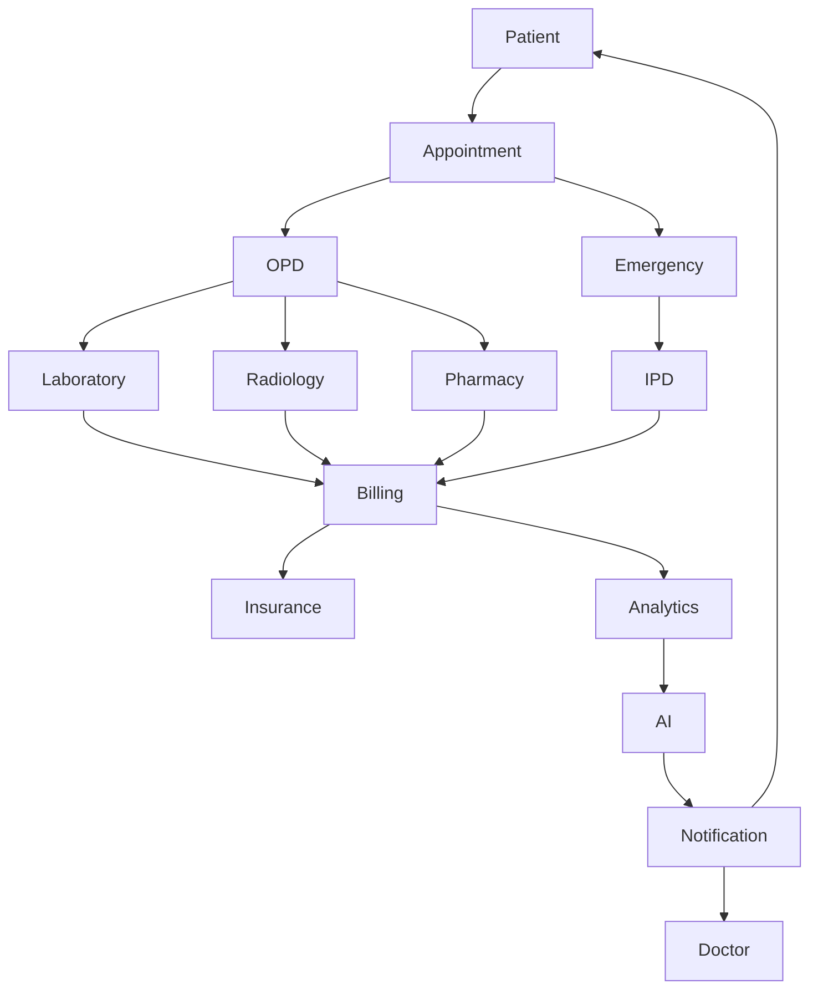
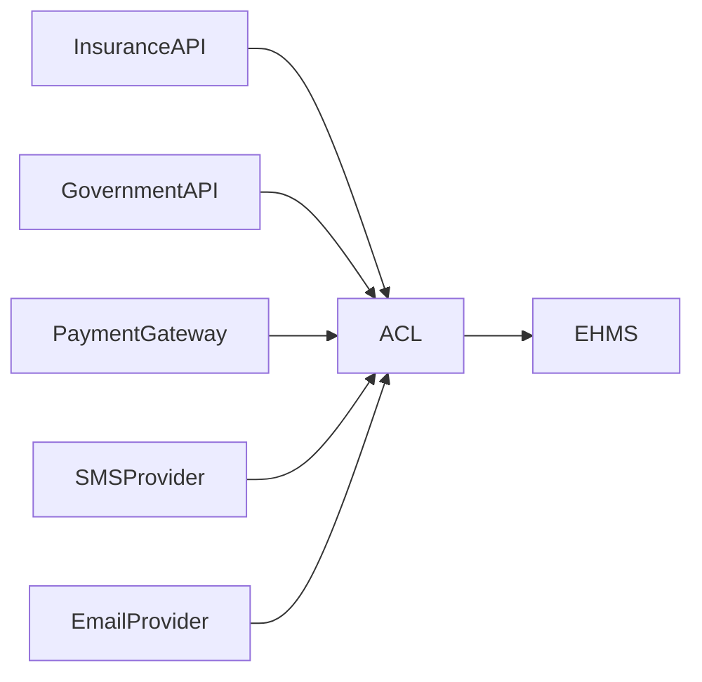

# Context Map

## Document Information

| Field | Value |
|--------|--------|
| Project | Enterprise Hospital Management System (EHMS) |
| Phase | Phase 1.5 – Enterprise Solution Design |
| Document | Context Map |
| Version | 1.0 |
| Status | Approved |
| Author | Pavithra K V |

---

# Executive Summary

The Context Map defines the relationships between all bounded contexts within the Enterprise Hospital Management System (EHMS).

It identifies how different business domains communicate, what type of relationship exists between them, and how integration occurs while preserving domain independence.

The Context Map serves as the foundation for service communication, API ownership, event-driven messaging, and future scalability.

---

# 1. Purpose

The Context Map aims to:

- Define communication between domains.
- Identify upstream and downstream services.
- Prevent tight coupling.
- Standardize integrations.
- Support independent deployment.
- Enable scalable microservice architecture.

---

# 2. Scope

This document covers:

- Core Domains
- Supporting Domains
- Business Domains
- Platform Domains
- Context Relationships
- Event Flow
- API Communication
- External Integrations

---

# 3. Design Principles

EHMS follows these principles:

- Independent bounded contexts
- API-first communication
- Event-driven integration
- Database-per-service
- No shared business logic
- Loose coupling
- High cohesion

---

# 4. Enterprise Context Map



---

# 5. Domain Relationships

## Core Clinical Domain

Patient

↓

Appointment

↓

OPD

↓

Emergency

↓

IPD

↓

ICU

↓

Operation Theatre

↓

EHR

---

## Supporting Domain

Laboratory

↓

Radiology

↓

Pharmacy

↓

Blood Bank

↓

Ambulance

↓

Telemedicine

---

## Business Domain

Billing

↓

Insurance

↓

HR

↓

Inventory

↓

Finance

---

## Platform Domain

Authentication

↓

Authorization

↓

Notification

↓

Analytics

↓

AI

↓

Audit

↓

Reporting

---

# 6. Upstream & Downstream Relationships

| Upstream | Downstream |
|----------|------------|
| Patient | Appointment |
| Appointment | OPD |
| OPD | Laboratory |
| OPD | Radiology |
| OPD | Pharmacy |
| Emergency | IPD |
| Laboratory | Billing |
| Billing | Analytics |
| Analytics | AI |

---

# 7. Customer–Supplier Relationships

| Customer | Supplier |
|-----------|----------|
| Appointment | Patient |
| OPD | Appointment |
| Laboratory | OPD |
| Radiology | OPD |
| Pharmacy | Doctor |
| Billing | Clinical Modules |
| Insurance | Billing |
| Analytics | All Services |

---

# 8. Conformist Relationships

The following services conform to external providers:

- Payment Gateway
- SMS Provider
- Email Provider
- Government Health Systems
- Insurance APIs
- Laboratory Devices
- PACS Systems

---

# 9. Anti-Corruption Layer (ACL)

External integrations pass through an ACL to isolate internal domain models.



Benefits:

- Protects domain model
- Simplifies external integration
- Reduces dependency on third-party changes

---

# 10. Open Host Services

The following contexts expose public APIs:

- Authentication
- Patient
- Appointment
- Billing
- Reporting
- Analytics

These services provide stable contracts for internal and external consumers.

---

# 11. Shared Kernel

Shared libraries include:

- Common Data Types
- Validation Rules
- Error Codes
- API Contracts
- Constants
- Pagination Models

Location:

```
packages/
├── shared-types
├── shared-constants
├── validators
└── api-contracts
```

---

# 12. Event Communication

The preferred communication pattern is asynchronous for business events.

Examples:

- PatientRegistered
- AppointmentBooked
- ConsultationCompleted
- LabOrderCreated
- LabResultPublished
- PrescriptionIssued
- MedicineDispensed
- InvoiceGenerated
- PaymentCompleted
- PatientDischarged

---

# 13. API Communication

REST APIs are used for:

- Read operations
- Immediate validation
- Authentication
- CRUD operations

Examples:

- Patient Lookup
- Appointment Booking
- Doctor Availability
- Invoice Retrieval

---

# 14. Integration Patterns

| Pattern | Usage |
|---------|-------|
| REST | Synchronous communication |
| Event Bus | Business events |
| Background Jobs | Long-running tasks |
| WebSockets | Live dashboards |
| Scheduled Jobs | Reports & maintenance |

---

# 15. Context Dependency Matrix

| Context | Depends On |
|----------|------------|
| Appointment | Patient |
| OPD | Appointment |
| Emergency | Patient |
| Laboratory | OPD |
| Radiology | OPD |
| Pharmacy | Doctor |
| Billing | Clinical Modules |
| Analytics | All Services |
| AI | Analytics + Clinical Services |

---

# 16. Architecture Decisions

| Decision | Reason |
|----------|--------|
| API-first communication | Standardization |
| Event-driven integration | Scalability |
| No shared database | Independence |
| Shared contracts | Consistency |
| ACL for external systems | Isolation |

---

# 17. Constraints

- No direct database access across contexts.
- APIs must be versioned.
- Events must be immutable.
- Platform services must not own clinical data.
- Domain ownership cannot overlap.

---

# 18. Risks & Mitigation

| Risk | Mitigation |
|------|------------|
| Tight coupling | Event-driven communication |
| Circular dependencies | Clear ownership |
| External API changes | Anti-Corruption Layer |
| High service dependency | Context isolation |

---

# 19. Future Enhancements

The Context Map should support:

- Multi-hospital deployment
- Multi-tenancy
- IoT integration
- Wearable devices
- Clinical research modules
- AI-assisted workflows
- External health exchanges

---

# 20. Related Documents

- 01 Domain-Driven Design
- 02 Business Capability Model
- 03 Bounded Contexts
- 05 Enterprise System Architecture
- 06 Microservice Architecture

---

# 21. Conclusion

The Context Map establishes how every business domain within EHMS interacts while preserving domain independence.

It provides a clear blueprint for service communication, API ownership, event-driven integration, and future system scalability without compromising maintainability.