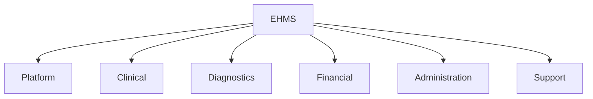
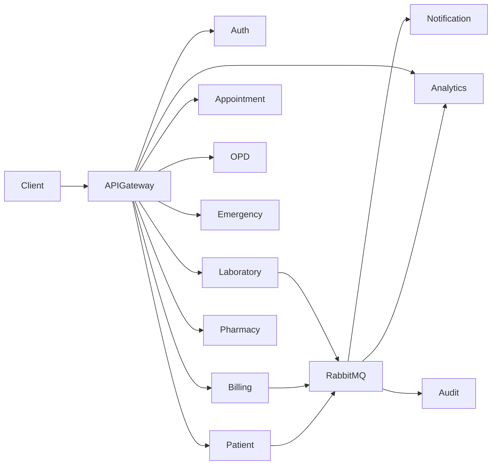

# Microservice Architecture

## Document Information

| Field | Value |
|--------|--------|
| Project | Enterprise Hospital Management System (EHMS) |
| Phase | Phase 1.5 – Enterprise Solution Design |
| Document | Microservice Architecture |
| Version | 1.0 |
| Status | Approved |
| Author | Pavithra K V |

---

# Executive Summary

This document defines the complete microservice architecture of the Enterprise Hospital Management System (EHMS).

The architecture follows Domain-Driven Design (DDD), where each bounded context is implemented as an independent microservice with its own database schema, business logic, APIs, and deployment lifecycle.

The design enables horizontal scalability, fault isolation, independent deployment, and long-term maintainability.

---

# 1. Objectives

The microservice architecture aims to:

- Align services with business domains.
- Enable independent deployment.
- Prevent shared databases.
- Support horizontal scaling.
- Simplify maintenance.
- Improve fault isolation.
- Enable continuous delivery.

---

# 2. Architecture Principles

EHMS follows:

- Domain-Driven Design
- Database per Service
- API First
- Event Driven
- Stateless Services
- Loose Coupling
- High Cohesion
- Independent Deployability

---

# 3. Enterprise Service Landscape

EHMS consists of six major service groups.

---

# 4. Platform Services

These services provide enterprise-wide capabilities.

| Service | Responsibility |
|----------|----------------|
| api-gateway | API routing |
| auth-service | Authentication |
| user-service | User management |
| notification-service | Notifications |
| audit-service | Audit logging |
| analytics-service | Reporting & dashboards |
| ai-service | AI capabilities |
| reporting-service | Report generation |
| configuration-service | Centralized configuration |
| monitoring-service | Health monitoring |

---

# 5. Clinical Services

| Service | Responsibility |
|----------|----------------|
| patient-service | Patient records |
| appointment-service | Appointment scheduling |
| doctor-service | Doctor management |
| nurse-service | Nursing operations |
| opd-service | Outpatient care |
| emergency-service | Emergency department |
| ipd-service | Inpatient care |
| icu-service | ICU management |
| ot-service | Operation theatre |
| ehr-service | Electronic health records |

---

# 6. Diagnostic Services

| Service | Responsibility |
|----------|----------------|
| laboratory-service | Laboratory operations |
| pathology-service | Pathology workflows |
| radiology-service | Radiology operations |
| pacs-service | Medical image management |
| pharmacy-service | Pharmacy |
| blood-bank-service | Blood bank |

---

# 7. Financial Services

| Service | Responsibility |
|----------|----------------|
| billing-service | Billing |
| insurance-service | Insurance claims |
| payment-service | Payments |
| finance-service | Financial accounting |

---

# 8. Administration Services

| Service | Responsibility |
|----------|----------------|
| hr-service | Human resources |
| attendance-service | Attendance |
| payroll-service | Payroll |
| inventory-service | Inventory |
| biomedical-service | Biomedical equipment |
| maintenance-service | Maintenance |

---

# 9. Support Services

| Service | Responsibility |
|----------|----------------|
| ambulance-service | Ambulance |
| housekeeping-service | Housekeeping |
| laundry-service | Laundry |
| diet-service | Diet management |
| security-service | Security |
| visitor-service | Visitor management |
| queue-service | Queue management |

---

# 10. High-Level Service Interaction

---

# 11. Database Ownership

Every microservice owns its own schema.

| Service | Database Schema |
|----------|-----------------|
| patient-service | patient_db |
| appointment-service | appointment_db |
| laboratory-service | laboratory_db |
| billing-service | billing_db |
| hr-service | hr_db |
| analytics-service | analytics_db |

No schema is shared.

---

# 12. API Ownership

Every service owns:

- REST APIs
- Business validation
- Database
- Domain events

Other services communicate only through APIs or events.

---

# 13. Event Publishing

Examples:

| Service | Published Events |
|----------|------------------|
| patient-service | PatientRegistered |
| appointment-service | AppointmentBooked |
| laboratory-service | LabResultReady |
| pharmacy-service | MedicineDispensed |
| billing-service | InvoiceGenerated |
| payment-service | PaymentCompleted |

---

# 14. Event Consumption

Examples:

| Service | Consumes |
|----------|----------|
| notification-service | All business events |
| analytics-service | All business events |
| audit-service | All business events |
| ai-service | Clinical events |

---

# 15. Service Communication

| Type | Technology |
|------|------------|
| Sync | REST |
| Async | RabbitMQ |
| Cache | Redis |
| Live Updates | WebSocket |

---

# 16. Scalability Strategy

Services scale independently.

Examples:

- OPD → 5 instances
- Laboratory → 3 instances
- Billing → 2 instances
- Analytics → 4 instances

Platform services remain independently scalable.

---

# 17. Security

Each service validates:

- JWT
- User Roles
- Permissions
- Tenant Context (future)
- Audit information

---

# 18. Deployment Model

Every service is:

- Dockerized
- Independently deployable
- Health checked
- Monitored
- Versioned

---

# 19. Architecture Decisions

| Decision | Reason |
|----------|--------|
| Microservices | Scalability |
| Database per service | Ownership |
| RabbitMQ | Async messaging |
| Redis | Performance |
| Docker | Portability |
| Kubernetes | Orchestration |

---

# 20. Future Expansion

Future services may include:

- Oncology
- Cardiology
- Organ Transplant
- Clinical Research
- Home Care
- Wearable Devices
- IoT Gateway

The architecture allows adding new services without modifying existing ones.

---

# 21. Related Documents

- 03 Bounded Contexts
- 04 Context Map
- 05 Enterprise System Architecture
- 07 Service Responsibility Matrix

---

# 22. Conclusion

The EHMS microservice architecture provides a modular, scalable, and resilient foundation aligned with enterprise software engineering practices. Each service has clear ownership, communicates through well-defined contracts, and can evolve independently while remaining part of a cohesive healthcare platform.