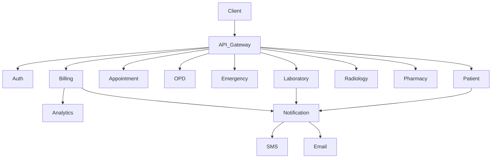
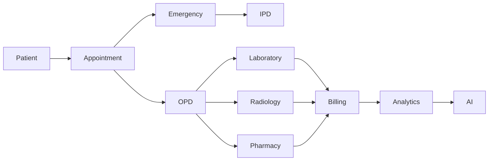

# Service Dependency Map

## Document Information

| Field | Value |
|--------|--------|
| Project | Enterprise Hospital Management System (EHMS) |
| Phase | Phase 1.5 – Enterprise Solution Design |
| Document | Service Dependency Map |
| Version | 1.0 |
| Status | Approved |
| Author | Pavithra K V |

---

# Executive Summary

This document defines the dependency relationships between all EHMS microservices.

A dependency map ensures services interact in a controlled manner, prevents circular dependencies, enables independent deployment, and improves long-term maintainability.

The goal is to keep services loosely coupled while allowing secure and efficient communication.

---

# 1. Purpose

The Service Dependency Map aims to:

- Identify service dependencies.
- Prevent circular dependencies.
- Define communication patterns.
- Improve deployment planning.
- Simplify scaling.
- Improve fault isolation.

---

# 2. Design Principles

EHMS follows these dependency principles:

- Dependencies always point in one direction.
- No circular dependencies.
- Services never access another service's database.
- Communication occurs only through APIs or events.
- Platform services remain reusable.

---

# 3. Dependency Levels

Three dependency levels are used.

## Level 1

Direct Dependency

REST API

---

## Level 2

Indirect Dependency

RabbitMQ Events

---

## Level 3

Independent

No communication

---

# 4. High-Level Dependency Diagram

---

# 5. Core Dependency Graph

---

# 6. Platform Service Dependencies

Authentication

↓

User

↓

API Gateway

↓

Notification

↓

Audit

↓

Monitoring

↓

Analytics

Platform services support business services but do not own clinical data.

---

# 7. Clinical Dependencies

| Service | Depends On |
|----------|------------|
| Appointment | Patient, Doctor |
| OPD | Appointment |
| Emergency | Patient |
| IPD | Patient |
| ICU | IPD |
| OT | IPD |
| EHR | Patient |

---

# 8. Diagnostic Dependencies

| Service | Depends On |
|----------|------------|
| Laboratory | OPD, IPD |
| Radiology | OPD, IPD |
| Pharmacy | EHR |
| Blood Bank | Patient |

---

# 9. Financial Dependencies

| Service | Depends On |
|----------|------------|
| Billing | All Clinical Services |
| Insurance | Billing |
| Analytics | Billing |

---

# 10. Administrative Dependencies

| Service | Depends On |
|----------|------------|
| HR | Authentication |
| Attendance | HR |
| Payroll | Attendance |
| Inventory | Billing |
| Maintenance | Inventory |

---

# 11. Support Dependencies

| Service | Depends On |
|----------|------------|
| Ambulance | Emergency |
| Laundry | IPD |
| Housekeeping | IPD |
| Diet | IPD |
| Security | Authentication |

---

# 12. Dependency Rules

Every service:

- Owns its database.
- Owns its APIs.
- Owns its events.

No service may:

- Read another database.
- Modify another database.
- Bypass API Gateway.

---

# 13. Event Dependencies

Published Events

- PatientRegistered
- AppointmentBooked
- LabResultReady
- PrescriptionIssued
- InvoiceGenerated
- PaymentCompleted

Consumed By

- Notification
- Analytics
- Audit
- AI

---

# 14. Dependency Matrix

| Service | REST | Events |
|----------|------|--------|
| Patient | Yes | Yes |
| Appointment | Yes | Yes |
| OPD | Yes | Yes |
| Laboratory | Yes | Yes |
| Billing | Yes | Yes |
| Analytics | No | Yes |
| AI | No | Yes |

---

# 15. Failure Isolation

If Laboratory fails:

- OPD continues.
- Billing waits.
- Notifications delayed.
- Analytics receives event later.

If Billing fails:

- Clinical care continues.
- Invoice queue retained.
- Events replay after recovery.

---

# 16. Architecture Decisions

| Decision | Reason |
|----------|--------|
| API Gateway | Centralized routing |
| RabbitMQ | Async communication |
| No shared DB | Data ownership |
| Event-driven design | Scalability |
| Retry queues | Reliability |

---

# 17. Constraints

- No cyclic dependencies.
- No synchronous dependency chains longer than three services.
- Retry failed events.
- APIs must be versioned.
- Services remain independently deployable.

---

# 18. Risks & Mitigation

| Risk | Mitigation |
|------|------------|
| Circular dependency | Architecture review |
| Cascading failures | Retry & circuit breaker |
| Tight coupling | Event-driven communication |
| Service latency | Redis caching |

---

# 19. Future Enhancements

- Service Mesh (Istio)
- Distributed Tracing
- Event Replay
- Multi-region deployment
- Kafka migration
- GraphQL Federation

---

# 20. Related Documents

- 03 Bounded Contexts
- 04 Context Map
- 05 Enterprise System Architecture
- 06 Microservice Architecture
- 07 Service Responsibility Matrix
- 09 API Gateway Design

---

# 21. Conclusion

The Service Dependency Map establishes clear interaction rules for EHMS microservices.

By defining explicit dependencies and communication patterns, the platform remains modular, scalable, resilient, and easy to evolve as additional services and hospital capabilities are introduced.