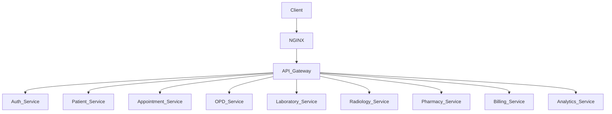
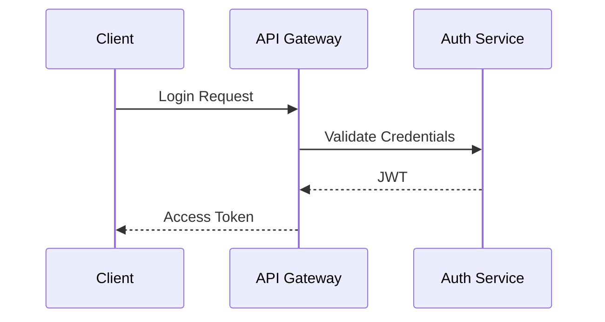
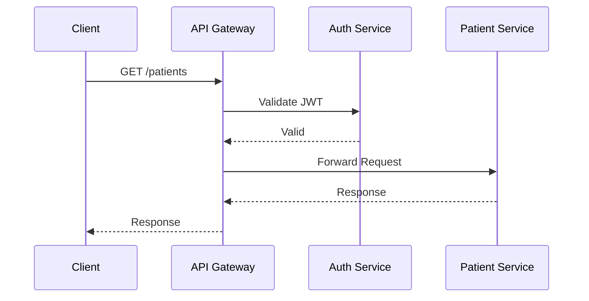

# API Gateway Design

## Document Information

| Field | Value |
|--------|--------|
| Project | Enterprise Hospital Management System (EHMS) |
| Phase | Phase 1.5 – Enterprise Solution Design |
| Document | API Gateway Design |
| Version | 1.0 |
| Status | Approved |
| Author | Pavithra K V |

---

# Executive Summary

The API Gateway serves as the unified entry point for all client applications interacting with the Enterprise Hospital Management System (EHMS).

It abstracts the internal microservice architecture from clients and provides centralized authentication, authorization, routing, request validation, API versioning, rate limiting, monitoring, and logging.

This design improves security, scalability, maintainability, and simplifies client integration.

---

# 1. Purpose

The API Gateway is responsible for:

- Receiving all incoming requests.
- Authenticating users.
- Authorizing access.
- Routing requests.
- Aggregating responses where required.
- Rate limiting.
- Request validation.
- Logging.
- Monitoring.
- API version management.

---

# 2. Design Goals

The gateway should provide:

- Single Entry Point
- Secure Access
- Low Latency
- High Availability
- Scalability
- Centralized Security
- API Versioning
- Request Tracking

---

# 3. Gateway Architecture

---

# 4. Client Applications

The gateway accepts requests from:

- Web Admin
- Web Doctor
- Web Nurse
- Web Patient
- Mobile Applications
- Self-Service Kiosk
- Third-Party Systems (future)

---

# 5. Core Responsibilities

## Authentication

- Validate JWT
- Validate OAuth2 Token
- Refresh Tokens
- Reject invalid tokens

---

## Authorization

Verify:

- User Role
- Permissions
- Department Access
- Resource Ownership

---

## Request Routing

Example:

| URL | Destination |
|------|-------------|
| /patients | patient-service |
| /appointments | appointment-service |
| /laboratory | laboratory-service |
| /billing | billing-service |
| /analytics | analytics-service |

---

## Request Validation

Validate:

- Required headers
- JWT
- Content-Type
- API Version
- Request Size

---

## Rate Limiting

Limits protect the platform.

Examples

Patient Portal

100 requests/min

Doctor Portal

500 requests/min

Admin

1000 requests/min

External APIs

50 requests/min

---

## API Versioning

Supported versions:

v1

↓

v2

↓

Future versions

Example

/api/v1/patients

/api/v2/patients

---

## Logging

Every request records:

- Timestamp
- User ID
- Role
- Endpoint
- Response Code
- Processing Time
- Trace ID

---

## Monitoring

Gateway metrics include:

- Requests/sec
- Latency
- Error Rate
- Active Users
- Failed Authentication
- Throughput

---

# 6. Authentication Flow

---

# 7. Authorized Request Flow

---

# 8. Error Handling

Gateway returns standardized responses.

Examples

401 Unauthorized

403 Forbidden

404 Not Found

429 Too Many Requests

500 Internal Server Error

---

# 9. Security Features

- HTTPS only
- JWT validation
- OAuth2
- RBAC
- Rate Limiting
- IP Filtering
- CORS
- Request Size Limits
- Audit Logging

---

# 10. High Availability

The gateway supports:

- Load Balancing
- Multiple Instances
- Health Checks
- Auto Scaling
- Rolling Updates

---

# 11. Deployment

Gateway deployed as:

NGINX

↓

API Gateway

↓

Microservices

---

# 12. Technology Stack

| Component | Technology |
|-----------|------------|
| Reverse Proxy | NGINX |
| API Gateway | FastAPI |
| Authentication | JWT + OAuth2 |
| Monitoring | Prometheus |
| Logging | ELK |
| Tracing | OpenTelemetry |

---

# 13. Architecture Decisions

| Decision | Reason |
|----------|--------|
| Single Gateway | Centralized control |
| JWT | Stateless authentication |
| NGINX | High performance reverse proxy |
| REST APIs | Standard communication |
| Versioned APIs | Backward compatibility |

---

# 14. Risks & Mitigation

| Risk | Mitigation |
|------|------------|
| Gateway failure | Multiple instances |
| DDoS | Rate limiting |
| Invalid tokens | JWT validation |
| Latency | Caching & load balancing |

---

# 15. Future Enhancements

- GraphQL Gateway
- API Federation
- Service Mesh Integration
- Web Application Firewall (WAF)
- Dynamic Routing
- API Developer Portal

---

# 16. Related Documents

- 05 Enterprise System Architecture
- 06 Microservice Architecture
- 08 Service Dependency Map
- 10 Event Driven Architecture

---

# 17. Conclusion

The API Gateway acts as the secure and centralized access layer for EHMS. It simplifies client interactions, enforces enterprise security policies, and enables scalable communication with backend microservices while maintaining flexibility for future growth.