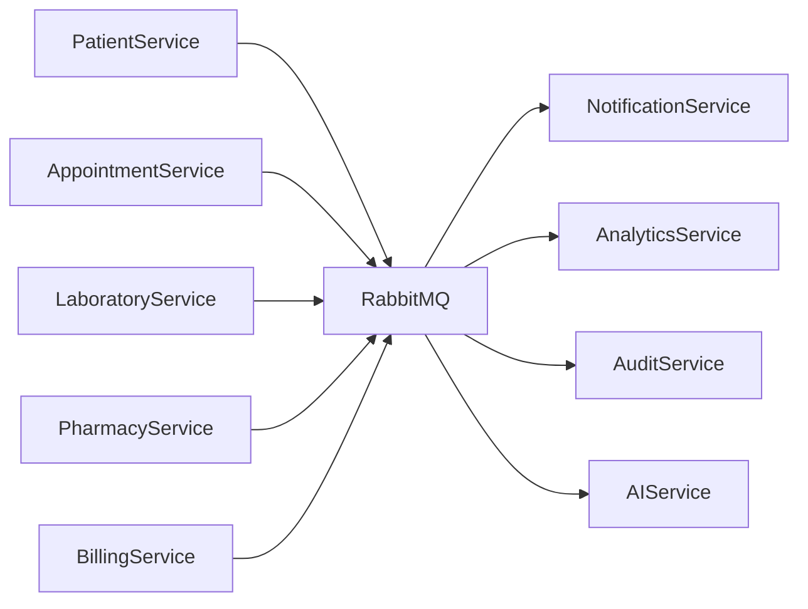

# Event-Driven Architecture

## Document Information

| Field | Value |
|--------|--------|
| Project | Enterprise Hospital Management System (EHMS) |
| Phase | Phase 1.5 – Enterprise Solution Design |
| Document | Event-Driven Architecture |
| Version | 1.0 |
| Status | Approved |
| Author | Pavithra K V |

---

# Executive Summary

The Enterprise Hospital Management System (EHMS) adopts an Event-Driven Architecture (EDA) to enable loose coupling, high scalability, fault tolerance, and asynchronous communication between microservices.

Instead of relying solely on synchronous REST APIs, business events are published whenever important activities occur. Interested services subscribe to these events and react independently without introducing tight coupling.

---

# 1. Purpose

The objectives of adopting Event-Driven Architecture are:

- Reduce service coupling
- Improve scalability
- Improve reliability
- Enable asynchronous workflows
- Support future integrations
- Simplify business process orchestration

---

# 2. Architecture Goals

The architecture should provide:

- Loose coupling
- High throughput
- Fault tolerance
- Event replay capability
- Reliable delivery
- Independent service deployment
- Horizontal scalability

---

# 3. Event Flow



---

# 4. Architecture Components

## Event Producers

Business services that publish events.

Examples:

- patient-service
- appointment-service
- laboratory-service
- radiology-service
- pharmacy-service
- billing-service
- emergency-service
- ipd-service

---

## Message Broker

RabbitMQ acts as the central event broker.

Responsibilities:

- Queue management
- Message routing
- Retry handling
- Dead Letter Queues
- Reliable delivery

---

## Event Consumers

Examples:

- notification-service
- analytics-service
- audit-service
- ai-service
- reporting-service

---

# 5. Event Lifecycle

```mermaid
flowchart LR

BusinessAction

↓

DomainEvent

↓

RabbitMQ

↓

Subscribers

↓

BusinessProcessing
```

---

# 6. Event Categories

## Clinical Events

- PatientRegistered
- PatientUpdated
- PatientDischarged
- AppointmentBooked
- ConsultationCompleted
- PrescriptionIssued

---

## Laboratory Events

- LabOrderCreated
- SampleCollected
- LabTestCompleted
- LabReportPublished

---

## Radiology Events

- ImagingRequested
- ScanCompleted
- RadiologyReportPublished

---

## Pharmacy Events

- PrescriptionVerified
- MedicineDispensed
- StockUpdated

---

## Billing Events

- InvoiceGenerated
- PaymentReceived
- RefundProcessed

---

## Administrative Events

- EmployeeCreated
- AttendanceMarked
- PayrollGenerated

---

# 7. Communication Model

| Communication | Technology |
|--------------|------------|
| Sync | REST |
| Async | RabbitMQ |
| Cache | Redis |
| Live Updates | WebSocket |

---

# 8. Event Publishing Rules

Every event must include:

- Event ID
- Event Type
- Timestamp
- Producer
- Entity ID
- Event Version
- Payload

---

# 9. Event Consumer Rules

Consumers must:

- Process events independently
- Support retries
- Handle duplicate events safely (idempotency)
- Log failures
- Avoid blocking the queue

---

# 10. Reliability Strategy

The event system provides:

- Durable queues
- Persistent messages
- Automatic acknowledgements
- Retry mechanism
- Dead Letter Queue (DLQ)
- Message ordering where required

---

# 11. Error Handling

If event processing fails:

1. Retry automatically.
2. Retry a configurable number of times.
3. Move to Dead Letter Queue.
4. Alert administrators.
5. Allow manual replay.

---

# 12. Security

Event communication includes:

- TLS encryption
- Authentication between services
- Authorization
- Payload validation
- Audit logging

---

# 13. Monitoring

Monitor:

- Queue depth
- Consumer lag
- Failed messages
- Retry count
- Processing time
- Throughput

---

# 14. Advantages

Benefits include:

- Loose coupling
- Better scalability
- Independent deployment
- Improved resilience
- Easier integration
- Faster background processing

---

# 15. Architecture Decisions

| Decision | Reason |
|----------|--------|
| RabbitMQ | Reliable messaging |
| Async events | Loose coupling |
| Durable queues | Reliability |
| DLQ | Failure recovery |
| Event versioning | Backward compatibility |

---

# 16. Risks & Mitigation

| Risk | Mitigation |
|------|------------|
| Lost messages | Durable queues |
| Duplicate processing | Idempotent consumers |
| Queue overflow | Monitoring & scaling |
| Event schema changes | Versioning |

---

# 17. Future Enhancements

Future improvements may include:

- Kafka for high-volume event streaming
- Event replay dashboard
- Event sourcing (selected domains)
- Saga orchestration
- Cloud-native managed messaging services

---

# 18. Related Documents

- 08 Service Dependency Map
- 09 API Gateway Design
- 11 Event Catalog
- 12 Message Broker Design

---

# 19. Conclusion

The Event-Driven Architecture enables EHMS to support scalable, resilient, and loosely coupled communication between services. By using business events and asynchronous processing, the platform remains responsive while allowing independent evolution of services.