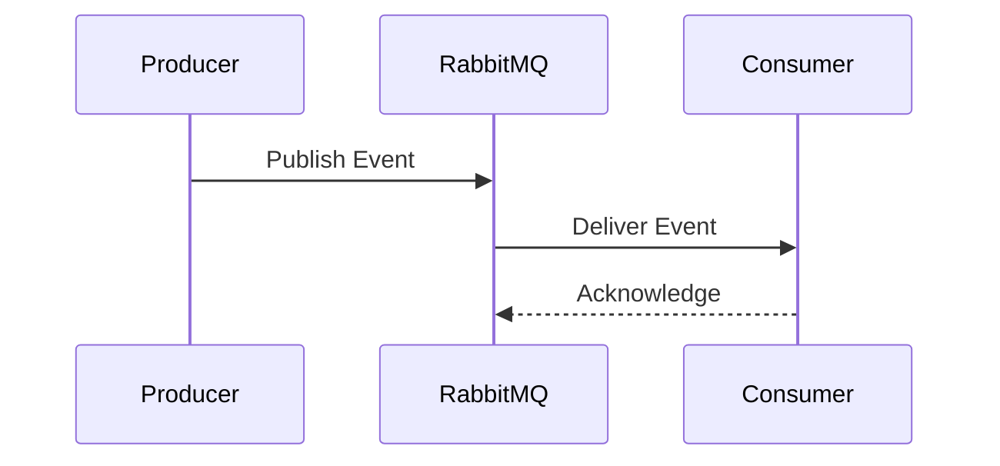

# Event Catalog

## Document Information

| Field | Value |
|--------|--------|
| Project | Enterprise Hospital Management System (EHMS) |
| Phase | Phase 1.5 – Enterprise Solution Design |
| Document | Event Catalog |
| Version | 1.0 |
| Status | Approved |
| Author | Pavithra K V |

---

# Executive Summary

The Event Catalog defines all business events published and consumed across the Enterprise Hospital Management System (EHMS).

It provides a centralized reference for event names, publishers, consumers, payloads, and business purpose, ensuring consistent event-driven communication throughout the platform.

---

# 1. Purpose

The Event Catalog aims to:

- Standardize business events.
- Eliminate duplicate event definitions.
- Define publishers and consumers.
- Enable reliable event-driven communication.
- Support future integrations.

---

# 2. Event Naming Convention

Every event follows:

```

<Entity><Action>

```

Examples:

- PatientRegistered
- AppointmentBooked
- LabOrderCreated
- InvoiceGenerated
- PaymentCompleted

---

# 3. Standard Event Structure

Every event contains:

| Field | Description |
|---------|-------------|
| Event ID | Unique identifier |
| Event Type | Event name |
| Version | Schema version |
| Timestamp | Event creation time |
| Producer | Publishing service |
| Entity ID | Business entity identifier |
| Correlation ID | Trace request across services |
| Payload | Business data |

---

# 4. Clinical Events

| Event | Producer | Consumers |
|--------|----------|-----------|
| PatientRegistered | patient-service | analytics, notification, audit |
| PatientUpdated | patient-service | analytics |
| AppointmentBooked | appointment-service | notification, analytics |
| AppointmentCancelled | appointment-service | notification |
| ConsultationCompleted | opd-service | ehr, billing |
| AdmissionCreated | ipd-service | billing |
| PatientDischarged | ipd-service | billing, analytics |

---

# 5. Laboratory Events

| Event | Producer | Consumers |
|--------|----------|-----------|
| LabOrderCreated | laboratory-service | notification |
| SampleCollected | laboratory-service | analytics |
| LabTestCompleted | laboratory-service | notification |
| LabReportPublished | laboratory-service | ehr-service |

---

# 6. Radiology Events

| Event | Producer | Consumers |
|--------|----------|-----------|
| ImagingRequested | radiology-service | notification |
| ScanCompleted | radiology-service | analytics |
| RadiologyReportPublished | radiology-service | ehr-service |

---

# 7. Pharmacy Events

| Event | Producer | Consumers |
|--------|----------|-----------|
| PrescriptionIssued | ehr-service | pharmacy-service |
| PrescriptionVerified | pharmacy-service | analytics |
| MedicineDispensed | pharmacy-service | billing-service |
| MedicineOutOfStock | pharmacy-service | inventory-service |

---

# 8. Billing Events

| Event | Producer | Consumers |
|--------|----------|-----------|
| InvoiceGenerated | billing-service | notification |
| PaymentReceived | billing-service | analytics |
| RefundProcessed | billing-service | audit-service |

---

# 9. Administrative Events

| Event | Producer | Consumers |
|--------|----------|-----------|
| EmployeeCreated | hr-service | notification |
| AttendanceMarked | attendance-service | payroll-service |
| PayrollGenerated | payroll-service | notification |

---

# 10. Platform Events

| Event | Producer | Consumers |
|--------|----------|-----------|
| UserLoggedIn | auth-service | audit-service |
| UserLoggedOut | auth-service | audit-service |
| NotificationSent | notification-service | analytics |
| ReportGenerated | reporting-service | notification |

---

# 11. Event Lifecycle



---

# 12. Event Versioning

Rules:

- Every event starts with Version 1.
- Breaking changes require a new version.
- Older versions remain supported during migration.
- Consumers must validate the version.

---

# 13. Event Retention

| Event Type | Retention |
|------------|-----------|
| Clinical | 7 Days |
| Billing | 30 Days |
| Audit | 1 Year |
| Notification | 3 Days |
| Analytics | 90 Days |

---

# 14. Dead Letter Queue (DLQ)

Failed events are:

1. Retried automatically.
2. Sent to DLQ after retry limit.
3. Logged.
4. Available for replay.

---

# 15. Event Security

Every event:

- Uses TLS encryption.
- Is authenticated.
- Is authorized.
- Is validated.
- Is logged.

Sensitive information should be minimized or protected according to organizational security requirements.

---

# 16. Architecture Decisions

| Decision | Reason |
|----------|--------|
| Event catalog | Standardization |
| Versioned events | Compatibility |
| DLQ | Reliability |
| Correlation IDs | Tracing |
| Idempotent consumers | Reliability |

---

# 17. Risks & Mitigation

| Risk | Mitigation |
|------|------------|
| Duplicate events | Idempotent consumers |
| Schema changes | Versioning |
| Lost events | Durable queues |
| Consumer failure | Retry & DLQ |

---

# 18. Related Documents

- 10 Event-Driven Architecture
- 12 Message Broker Design
- 23 Observability Architecture

---

# 19. Conclusion

The Event Catalog provides a single, authoritative reference for business events within EHMS. It standardizes event communication, improves interoperability between services, and supports reliable, scalable event-driven workflows.