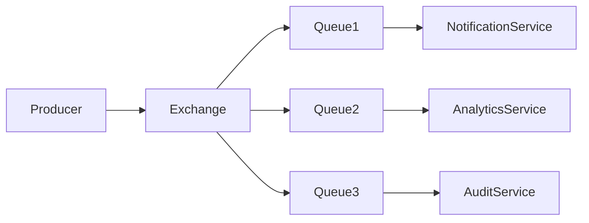
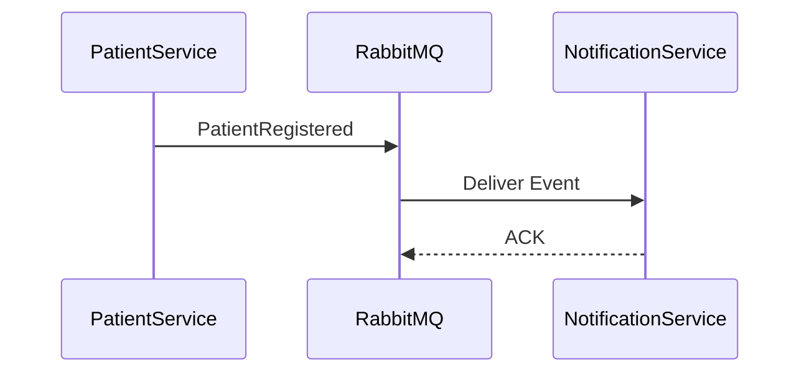

# Message Broker Design

## Document Information

| Field | Value |
|--------|--------|
| Project | Enterprise Hospital Management System (EHMS) |
| Phase | Phase 1.5 – Enterprise Solution Design |
| Document | Message Broker Design |
| Version | 1.0 |
| Status | Approved |
| Author | Pavithra K V |

---

# Executive Summary

The Enterprise Hospital Management System (EHMS) uses RabbitMQ as its primary message broker for asynchronous communication between microservices.

RabbitMQ provides reliable message delivery, queue management, retries, dead-letter handling, and loose coupling between services.

This document defines the broker topology, exchanges, queues, routing strategy, retry mechanism, and operational guidelines.

---

# 1. Purpose

The Message Broker Design aims to:

- Enable asynchronous communication.
- Decouple services.
- Improve reliability.
- Support retries.
- Prevent message loss.
- Simplify event routing.
- Support future scalability.

---

# 2. Design Principles

EHMS follows:

- Publisher–Subscriber Pattern
- Event-Driven Communication
- At-Least-Once Delivery
- Durable Messaging
- Idempotent Consumers
- Dead Letter Queues
- Exchange-Based Routing

---

# 3. High-Level Broker Architecture



---

# 4. RabbitMQ Components

## Exchanges

Responsible for routing messages.

Types:

- Direct Exchange
- Topic Exchange
- Fanout Exchange
- Headers Exchange

EHMS primarily uses **Topic Exchanges**.

---

## Queues

Queues temporarily store events until consumed.

Examples:

- notification.queue
- analytics.queue
- audit.queue
- billing.queue
- laboratory.queue

---

## Routing Keys

Examples:

```
patient.registered
appointment.booked
laboratory.completed
radiology.completed
billing.invoice.generated
payment.completed
notification.sent
```

---

# 5. Exchange Design

| Exchange | Purpose |
|-----------|---------|
| clinical.exchange | Clinical events |
| laboratory.exchange | Laboratory events |
| pharmacy.exchange | Pharmacy events |
| billing.exchange | Billing events |
| platform.exchange | Platform events |

---

# 6. Queue Design

| Queue | Consumer |
|--------|----------|
| notification.queue | notification-service |
| analytics.queue | analytics-service |
| audit.queue | audit-service |
| ai.queue | ai-service |
| reporting.queue | reporting-service |

---

# 7. Message Flow



---

# 8. Retry Strategy

If message processing fails:

1. Retry automatically.
2. Maximum 3 retries.
3. Exponential backoff.
4. Move to Dead Letter Queue (DLQ).
5. Notify administrators.

---

# 9. Dead Letter Queue (DLQ)

Every queue has an associated DLQ.

Examples:

- notification.dlq
- analytics.dlq
- billing.dlq

Messages remain available for:

- Inspection
- Replay
- Root Cause Analysis

---

# 10. Message Format

Every message contains:

| Field | Description |
|--------|-------------|
| Message ID | Unique ID |
| Event Type | Business event |
| Version | Schema version |
| Timestamp | Creation time |
| Correlation ID | Distributed tracing |
| Producer | Publishing service |
| Payload | Business data |

---

# 11. Delivery Guarantees

EHMS supports:

- Durable queues
- Persistent messages
- Manual acknowledgements
- Retry queues
- Dead Letter Queues

Delivery model:

**At-Least-Once Delivery**

Consumers must therefore be idempotent.

---

# 12. Security

Broker security includes:

- TLS encryption
- Username/password authentication
- Role-based permissions
- Virtual Hosts
- Audit logging

---

# 13. Monitoring

Monitor:

- Queue depth
- Message throughput
- Consumer lag
- Failed deliveries
- Retry count
- DLQ size
- Publish rate
- Consume rate

---

# 14. Scaling Strategy

RabbitMQ supports:

- Multiple consumers
- Queue partitioning
- Horizontal scaling
- High Availability clusters

---

# 15. Architecture Decisions

| Decision | Reason |
|----------|--------|
| RabbitMQ | Reliable asynchronous messaging |
| Topic exchanges | Flexible routing |
| Durable queues | Prevent message loss |
| DLQ | Failure recovery |
| Manual ACK | Reliable processing |

---

# 16. Risks & Mitigation

| Risk | Mitigation |
|------|------------|
| Message loss | Durable queues |
| Duplicate delivery | Idempotent consumers |
| Queue overload | Monitoring & scaling |
| Consumer failure | Retry + DLQ |

---

# 17. Future Enhancements

Future improvements include:

- Kafka for event streaming
- Multi-region RabbitMQ clusters
- Event replay dashboard
- Schema Registry
- Saga orchestration
- Cloud-managed messaging services

---

# 18. Related Documents

- 10 Event-Driven Architecture
- 11 Event Catalog
- 13 Canonical Data Model
- 23 Observability Architecture

---

# 19. Conclusion

The Message Broker Design provides a reliable, scalable, and secure messaging infrastructure for EHMS.

By combining RabbitMQ, topic exchanges, durable queues, retry policies, and dead-letter queues, the platform ensures dependable asynchronous communication between independently deployable microservices.