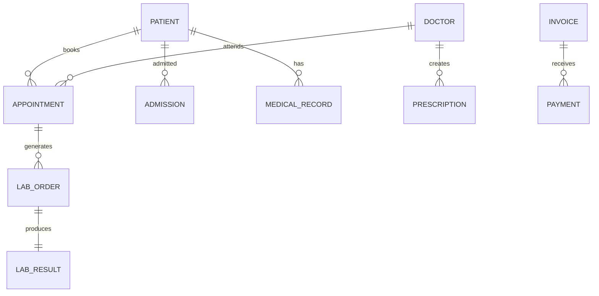

# Canonical Data Model

## Document Information

| Field | Value |
|--------|--------|
| Project | Enterprise Hospital Management System (EHMS) |
| Phase | Phase 1.5 – Enterprise Solution Design |
| Document | Canonical Data Model |
| Version | 1.0 |
| Status | Approved |
| Author | Pavithra K V |

---

# Executive Summary

The Canonical Data Model (CDM) defines the enterprise-wide business entities used throughout the Enterprise Hospital Management System (EHMS).

It establishes a common vocabulary and consistent data representation across all microservices, APIs, events, and reports. While each microservice owns its own database schema, shared concepts follow the same business meaning.

The CDM improves interoperability, reduces ambiguity, and simplifies future integrations.

---

# 1. Purpose

The Canonical Data Model aims to:

- Standardize enterprise data definitions.
- Establish common business terminology.
- Improve API consistency.
- Simplify event-driven communication.
- Support future integrations.
- Reduce data duplication.

---

# 2. Design Principles

The Canonical Data Model follows:

- Business-first modeling
- Technology independence
- Stable identifiers
- Consistent naming
- Database independence
- Domain ownership
- Backward compatibility

---

# 3. Canonical Entity Categories

The enterprise model consists of the following categories:

- Patient
- Clinical
- Employee
- Organization
- Financial
- Inventory
- Infrastructure
- Platform

---

# 4. Core Business Entities

| Entity | Description | Owner Service |
|---------|-------------|---------------|
| Patient | Hospital patient | patient-service |
| Doctor | Medical practitioner | doctor-service |
| Nurse | Nursing staff | nurse-service |
| Employee | Hospital employee | hr-service |
| Department | Hospital department | department-service |
| Appointment | Consultation booking | appointment-service |
| Admission | Inpatient admission | ipd-service |
| Encounter | Clinical interaction | ehr-service |
| Prescription | Medication order | ehr-service |
| Invoice | Billing document | billing-service |

---

# 5. Clinical Entities

| Entity | Owner |
|----------|-------|
| Medical Record | ehr-service |
| Diagnosis | ehr-service |
| Allergy | ehr-service |
| Procedure | ot-service |
| Lab Order | laboratory-service |
| Lab Result | laboratory-service |
| Radiology Order | radiology-service |
| Radiology Report | radiology-service |

---

# 6. Administrative Entities

| Entity | Owner |
|----------|-------|
| Employee | hr-service |
| Attendance | attendance-service |
| Payroll | payroll-service |
| Asset | biomedical-service |
| Inventory Item | inventory-service |
| Vendor | inventory-service |

---

# 7. Financial Entities

| Entity | Owner |
|----------|-------|
| Invoice | billing-service |
| Payment | billing-service |
| Insurance Claim | insurance-service |
| Refund | billing-service |

---

# 8. Platform Entities

| Entity | Owner |
|----------|-------|
| User | auth-service |
| Role | auth-service |
| Permission | auth-service |
| Notification | notification-service |
| Audit Log | audit-service |

---

# 9. Canonical Identifier Standards

| Entity | Identifier |
|----------|------------|
| Patient | UHID |
| Doctor | Doctor ID |
| Employee | Employee ID |
| Appointment | Appointment ID |
| Admission | Admission ID |
| Invoice | Invoice Number |
| Laboratory Order | Lab Order ID |

Identifiers are immutable and unique across the system.

---

# 10. Naming Standards

General Rules:

- Singular entity names
- PascalCase for entity names
- camelCase for JSON fields
- snake_case for database tables
- UUID for internal identifiers

Example:

Entity

Patient

JSON

```json
{
  "patientId": "UUID",
  "uhid": "EHMS000001",
  "firstName": "John",
  "lastName": "Doe"
}
```

Database

patient

patient_address

patient_contact

---

# 11. Data Ownership

Each entity has exactly one owning service.

Other services:

- Read through APIs.
- Subscribe to events.
- Maintain local references where necessary.

No service directly modifies another service's data.

---

# 12. Entity Relationships



---

# 13. Data Exchange Rules

Data exchanged between services must:

- Use JSON.
- Include entity identifiers.
- Include timestamps.
- Include version information.
- Avoid unnecessary duplication.

---

# 14. Versioning

Rules:

- Canonical entities evolve through versioning.
- Backward compatibility is preferred.
- Breaking changes require a new version.

---

# 15. Data Quality

The model emphasizes:

- Completeness
- Consistency
- Accuracy
- Integrity
- Uniqueness
- Traceability

---

# 16. Architecture Decisions

| Decision | Reason |
|----------|--------|
| Canonical model | Consistency |
| Stable IDs | Traceability |
| Single owner | Clear responsibility |
| JSON exchange | Interoperability |
| UUIDs | Global uniqueness |

---

# 17. Risks & Mitigation

| Risk | Mitigation |
|------|------------|
| Duplicate entities | Single ownership |
| Inconsistent naming | Naming standards |
| Schema drift | Versioning |
| Data inconsistency | API-first integration |

---

# 18. Future Enhancements

Future enhancements include:

- FHIR resource mapping
- HL7 integration
- Multi-language support
- Multi-hospital entity federation
- Master Patient Index (MPI)

---

# 19. Related Documents

- 01 Domain-Driven Design
- 03 Bounded Contexts
- 06 Microservice Architecture
- 14 Master Data Management
- 20 API Design Standards

---

# 20. Conclusion

The Canonical Data Model provides a shared enterprise vocabulary for EHMS. It enables consistent communication across services while preserving the autonomy of each microservice, laying the foundation for scalable APIs, reliable event exchange, and future interoperability with healthcare standards.