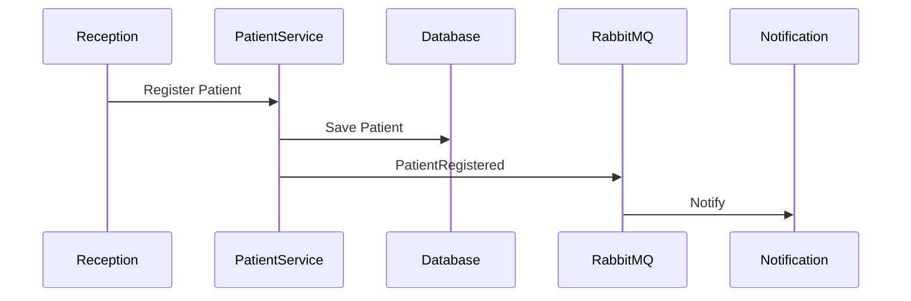
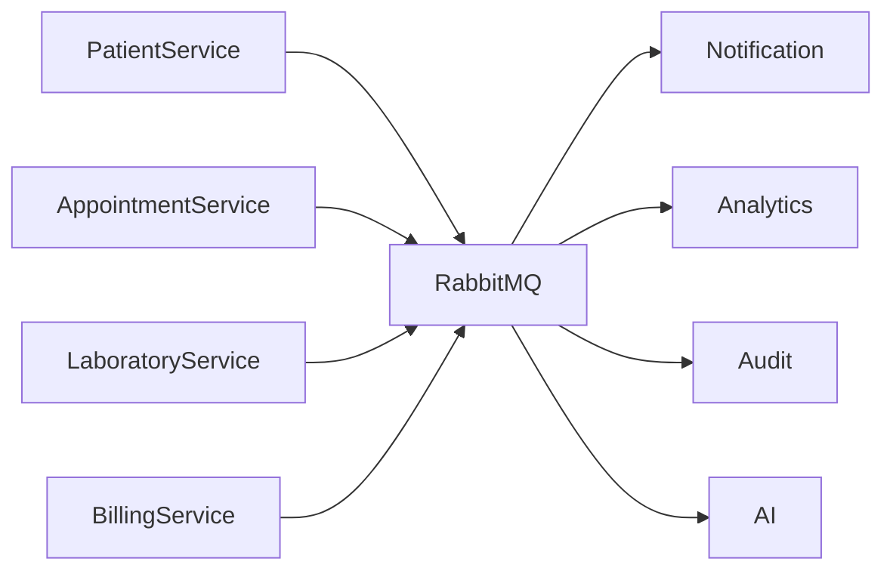

# Data Flow Architecture

## Document Information

| Field | Value |
|--------|--------|
| Project | Enterprise Hospital Management System (EHMS) |
| Phase | Phase 1.5 – Enterprise Solution Design |
| Document | Data Flow Architecture |
| Version | 1.0 |
| Status | Approved |
| Author | Pavithra K V |

---

# Executive Summary

The Data Flow Architecture defines how information moves across the Enterprise Hospital Management System (EHMS).

It illustrates how business data is created, validated, processed, stored, exchanged, archived, and consumed while maintaining data integrity, security, and traceability.

The architecture supports both synchronous REST communication and asynchronous event-driven messaging.

---

# 1. Purpose

This document aims to:

- Define enterprise data movement.
- Identify data producers and consumers.
- Standardize information exchange.
- Improve data consistency.
- Support auditability.
- Enable future scalability.

---

# 2. Data Flow Principles

EHMS follows these principles:

- Single Source of Truth
- Database per Service
- API-first Communication
- Event-driven Synchronization
- Data Ownership
- End-to-End Traceability
- Security by Design

---

# 3. Enterprise Data Flow

```mermaid
flowchart LR

Patient

↓

PatientService

↓

AppointmentService

↓

Doctor

↓

OPD

↓

Laboratory

↓

Radiology

↓

Pharmacy

↓

Billing

↓

Analytics

↓

AI

↓

Reports
```

---

# 4. Patient Registration Flow



---

# 5. Appointment Workflow

Patient

↓

Appointment Booking

↓

Doctor Assignment

↓

Schedule Update

↓

Confirmation Notification

↓

Calendar Update

---

# 6. OPD Consultation Flow

```mermaid
flowchart LR

Appointment

↓

OPD Visit

↓

Doctor Consultation

↓

Diagnosis

↓

Prescription

↓

Lab Orders

↓

Billing
```

---

# 7. Laboratory Workflow

Lab Order

↓

Sample Collection

↓

Testing

↓

Result Validation

↓

Report Generation

↓

EHR Update

↓

Billing

---

# 8. Radiology Workflow

Radiology Request

↓

Imaging

↓

Radiologist Review

↓

Report

↓

EHR Update

↓

Billing

---

# 9. Pharmacy Workflow

Prescription

↓

Verification

↓

Medicine Dispensing

↓

Inventory Update

↓

Billing

---

# 10. Billing Workflow

Clinical Services

↓

Invoice Generation

↓

Payment

↓

Receipt

↓

Analytics

↓

Financial Reports

---

# 11. Event-Based Data Flow



---

# 12. API-Based Data Flow

REST APIs are used for:

- Patient Lookup
- Appointment Booking
- Authentication
- Billing Retrieval
- Doctor Availability
- Department Information

---

# 13. Data Storage Flow

```mermaid
flowchart LR

Service

↓

Validation

↓

Database

↓

Event

↓

Consumers

↓

Analytics
```

---

# 14. External Data Flow

External Systems include:

- Insurance Providers
- Payment Gateway
- SMS Provider
- Email Provider
- Government Health Systems

Integration occurs through:

- REST APIs
- RabbitMQ Events
- Secure HTTPS

---

# 15. Reporting Flow

Business Data

↓

Analytics

↓

Data Aggregation

↓

Dashboard

↓

Management Reports

---

# 16. Security Controls

Every data flow enforces:

- JWT Authentication
- RBAC Authorization
- HTTPS Encryption
- Input Validation
- Audit Logging
- Trace IDs

---

# 17. Data Validation

Validation occurs at:

- Client
- API Gateway
- Service Layer
- Database Layer

---

# 18. Monitoring

The following are monitored:

- API latency
- Queue depth
- Database response time
- Event processing time
- Failed requests
- Failed messages

---

# 19. Architecture Decisions

| Decision | Reason |
|----------|--------|
| API-first | Standard communication |
| Event-driven | Loose coupling |
| Database per service | Data ownership |
| Trace IDs | End-to-end observability |
| Analytics pipeline | Enterprise reporting |

---

# 20. Risks & Mitigation

| Risk | Mitigation |
|------|------------|
| Data duplication | Master Data Management |
| Lost events | RabbitMQ durable queues |
| Invalid data | Multi-layer validation |
| Unauthorized access | JWT + RBAC |

---

# 21. Future Enhancements

Future improvements include:

- Real-time streaming analytics
- FHIR interoperability
- IoT medical device integration
- AI-assisted workflow optimization
- Cross-hospital data exchange

---

# 22. Related Documents

- 10 Event-Driven Architecture
- 11 Event Catalog
- 12 Message Broker Design
- 13 Canonical Data Model
- 14 Master Data Management

---

# 23. Conclusion

The Data Flow Architecture provides a complete blueprint for how information travels across EHMS. By combining REST APIs, asynchronous events, secure data ownership, and enterprise monitoring, the platform ensures reliable, scalable, and traceable information flow throughout the hospital ecosystem.