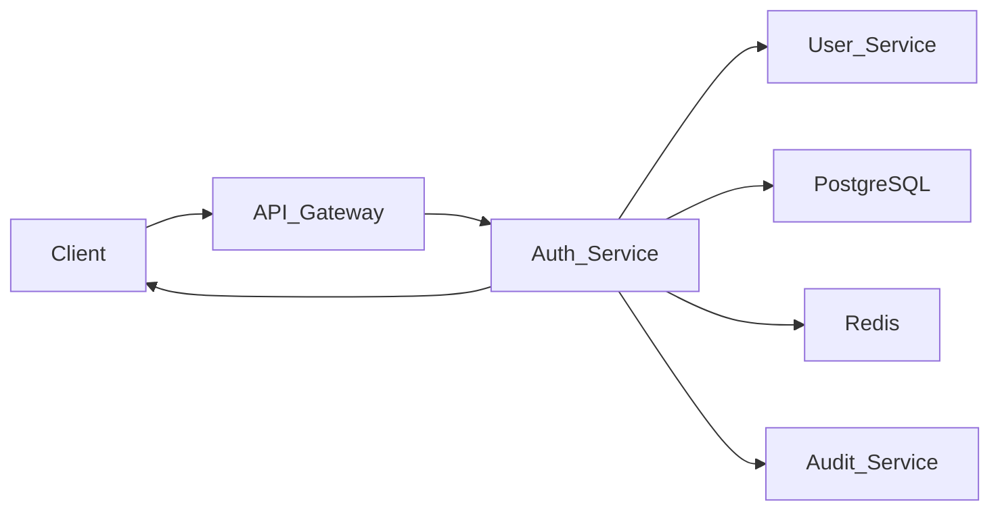
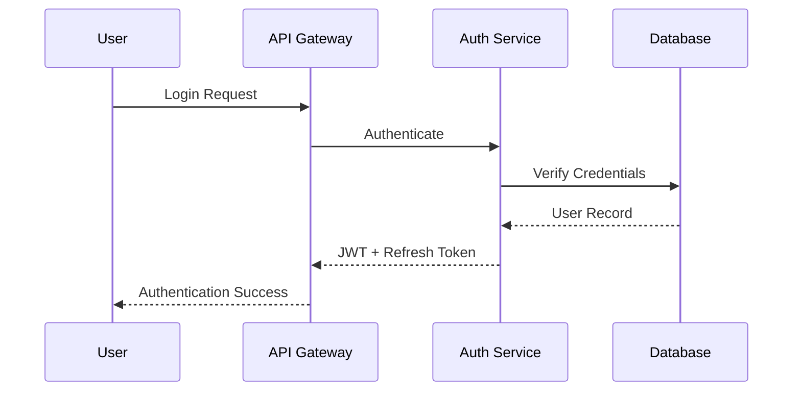
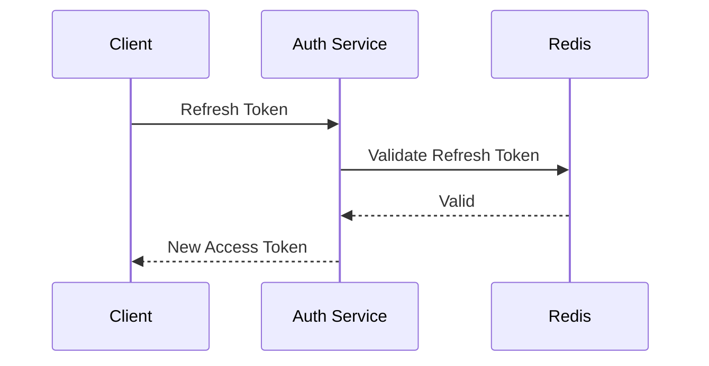

# Authentication Architecture

## Document Information

| Field | Value |
|--------|--------|
| Project | Enterprise Hospital Management System (EHMS) |
| Phase | Phase 1.5 – Enterprise Solution Design |
| Document | Authentication Architecture |
| Version | 1.0 |
| Status | Approved |
| Author | Pavithra K V |

---

# Executive Summary

Authentication verifies the identity of every user accessing the Enterprise Hospital Management System (EHMS).

EHMS uses a centralized Authentication Service implementing JWT-based authentication with OAuth2 principles, secure password hashing, refresh tokens, role-based identity validation, and optional Multi-Factor Authentication (MFA).

The authentication layer ensures secure access while remaining scalable and stateless.

---

# 1. Purpose

The Authentication Architecture aims to:

- Verify user identity.
- Secure access to all services.
- Support stateless authentication.
- Protect user credentials.
- Enable Single Sign-On (future).
- Support enterprise scalability.

---

# 2. Authentication Principles

EHMS follows:

- Zero Trust Security
- Least Privilege
- Stateless Authentication
- Secure Password Storage
- Token-Based Authentication
- HTTPS Everywhere
- Audit Logging

---

# 3. Authentication Components

| Component | Responsibility |
|-----------|----------------|
| API Gateway | Entry point |
| Auth Service | Authentication |
| User Service | User profile |
| JWT Provider | Token generation |
| Redis | Refresh token/session storage |
| Audit Service | Authentication logs |

---

# 4. Authentication Architecture

---

# 5. Authentication Flow

---

# 6. Login Process

Steps:

1. User submits username/email and password.
2. API Gateway forwards request.
3. Auth Service validates credentials.
4. Password hash is verified.
5. Access token is generated.
6. Refresh token is generated.
7. Audit log is created.
8. Tokens returned to client.

---

# 7. JWT Structure

JWT contains:

- User ID
- Username
- Role
- Department
- Token ID (JTI)
- Issued At
- Expiration
- Issuer
- Audience

Sensitive information must **not** be stored inside the JWT payload.

---

# 8. Token Lifecycle

| Token | Lifetime |
|--------|----------|
| Access Token | 15 Minutes |
| Refresh Token | 7 Days |

Refresh tokens are stored securely and may be revoked upon logout or security events.

---

# 9. Password Policy

Passwords must include:

- Minimum 12 characters
- Uppercase letter
- Lowercase letter
- Number
- Special character

Passwords are hashed using **Argon2id** (preferred) or **bcrypt** if Argon2id is unavailable.

Plain-text passwords are never stored.

---

# 10. Refresh Token Flow

---

# 11. Logout

Logout performs:

- Refresh token revocation
- Session termination
- Audit logging
- Client token invalidation

---

# 12. Account Protection

Security controls include:

- Failed login tracking
- Temporary account lockout
- Rate limiting
- Password reset
- Session timeout
- Device/session management (future)

---

# 13. Multi-Factor Authentication (MFA)

Future support includes:

- TOTP Authenticator Apps
- Email OTP
- SMS OTP
- Hardware Security Keys (future)

MFA can be enabled per user role.

---

# 14. Session Management

EHMS uses stateless authentication.

Session information includes:

- Refresh token
- Device ID (optional)
- Last login
- Last activity

---

# 15. Security Controls

Authentication enforces:

- HTTPS
- JWT validation
- Token expiration
- Refresh token rotation
- Audit logging
- Brute-force protection

---

# 16. Authentication Errors

Standard responses:

| Code | Meaning |
|------|---------|
| 400 | Invalid Request |
| 401 | Unauthorized |
| 403 | Forbidden |
| 423 | Account Locked |
| 429 | Too Many Requests |

---

# 17. Architecture Decisions

| Decision | Reason |
|----------|--------|
| JWT | Stateless authentication |
| Refresh Tokens | Better security |
| Argon2id | Strong password hashing |
| Redis | Fast token validation |
| MFA | Enhanced protection |

---

# 18. Risks & Mitigation

| Risk | Mitigation |
|------|------------|
| Token theft | HTTPS + short token lifetime |
| Brute-force attacks | Rate limiting & lockout |
| Credential leakage | Strong hashing |
| Session hijacking | Refresh token rotation |

---

# 19. Future Enhancements

Future capabilities include:

- Single Sign-On (SSO)
- OpenID Connect
- Biometric authentication
- Passkeys (WebAuthn)
- Adaptive authentication
- Risk-based authentication

---

# 20. Related Documents

- 09 API Gateway Design
- 16 Configuration Management
- 18 Authorization (RBAC)
- 19 Security Architecture

---

# 21. Conclusion

The Authentication Architecture provides a secure and scalable identity verification mechanism for EHMS. By combining JWT, refresh tokens, secure password hashing, audit logging, and optional MFA, the platform establishes a strong foundation for protecting users and clinical data while supporting enterprise growth.