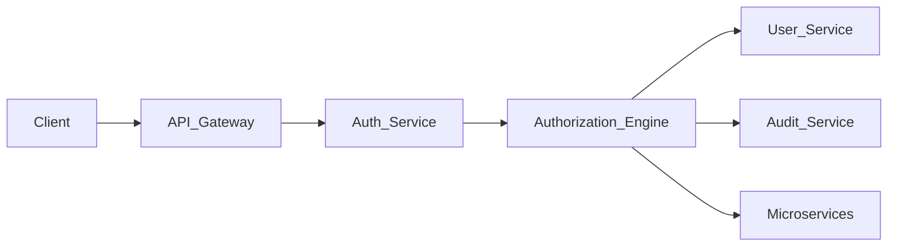
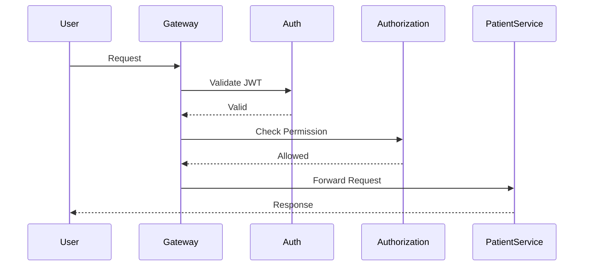

# Authorization Architecture (Role-Based Access Control - RBAC)

## Document Information

| Field | Value |
|--------|--------|
| Project | Enterprise Hospital Management System (EHMS) |
| Phase | Phase 1.5 – Enterprise Solution Design |
| Document | Authorization (RBAC) |
| Version | 1.0 |
| Status | Approved |
| Author | Pavithra K V |

---

# Executive Summary

Authorization determines what authenticated users are allowed to access within the Enterprise Hospital Management System (EHMS).

EHMS implements Role-Based Access Control (RBAC) with fine-grained permissions to ensure users access only the information and functionality required for their responsibilities.

The authorization model supports departmental access, resource ownership, and future Attribute-Based Access Control (ABAC) enhancements.

---

# 1. Purpose

The Authorization Architecture aims to:

- Enforce least-privilege access.
- Protect sensitive medical data.
- Support department-specific permissions.
- Simplify permission management.
- Meet healthcare security requirements.
- Enable future authorization models.

---

# 2. Authorization Principles

EHMS follows:

- Least Privilege
- Need-to-Know Access
- Separation of Duties
- Default Deny
- Role-Based Access
- Auditability

---

# 3. Authorization Components

| Component | Responsibility |
|-----------|----------------|
| API Gateway | Validate JWT |
| Auth Service | Identity |
| Authorization Engine | Permission Evaluation |
| User Service | User Information |
| Audit Service | Permission Audit |

---

# 4. Authorization Architecture



---

# 5. Access Evaluation Flow



---

# 6. Enterprise Roles

Core roles include:

- Super Administrator
- Hospital Administrator
- Medical Director
- Department Head
- Doctor
- Resident Doctor
- Nurse
- Laboratory Technician
- Radiology Technician
- Pharmacist
- Receptionist
- Billing Executive
- HR Executive
- Inventory Manager
- Security Staff
- Housekeeping Staff
- Patient
- External Auditor (Read-only)

---

# 7. Permission Categories

Permissions are grouped by business capability:

- Patient Management
- Appointment Management
- OPD
- IPD
- Emergency
- Laboratory
- Radiology
- Pharmacy
- Billing
- HR
- Inventory
- Reports
- Administration
- System Configuration

---

# 8. Permission Model

Permission format:

```
resource:action
```

Examples:

```
patient:create
patient:read
patient:update
patient:delete

appointment:create
appointment:update

billing:read
billing:update

report:export
```

---

# 9. Sample Permission Matrix

| Role | Patient | Billing | Reports | Admin |
|------|---------|---------|---------|-------|
| Super Admin | CRUD | CRUD | CRUD | CRUD |
| Doctor | Read/Update | Read | Read | No |
| Nurse | Read/Update | No | Read | No |
| Receptionist | Create/Read | Read | No | No |
| Patient | Own Record Only | Own Bills | Own Reports | No |

---

# 10. Department-Level Access

Department users can access only their department's operational data.

Examples:

- Cardiology staff → Cardiology records
- Radiology staff → Radiology workflows
- Laboratory staff → Laboratory workflows

Cross-department access requires explicit authorization.

---

# 11. Resource Ownership

Patients:

- Access only their own data.

Doctors:

- Access patients under their care, subject to hospital policies.

Administrators:

- Access organizational data according to assigned responsibilities.

---

# 12. Emergency Access

Break-glass access allows temporary emergency access when required.

Requirements:

- Explicit justification
- Audit logging
- Time-limited access
- Administrative review

---

# 13. Audit Logging

Authorization events recorded:

- Login
- Logout
- Permission granted
- Permission denied
- Role assignment
- Emergency access
- Administrative changes

---

# 14. Security Controls

Authorization enforces:

- JWT validation
- RBAC
- Department restrictions
- Ownership checks
- API authorization
- Audit logging

---

# 15. Future ABAC Support

Future enhancements may include:

- Location-based access
- Time-based access
- Device-based policies
- Risk-based policies
- Dynamic authorization rules

---

# 16. Architecture Decisions

| Decision | Reason |
|----------|--------|
| RBAC | Simplicity & scalability |
| Least Privilege | Reduce security risk |
| Default Deny | Secure by default |
| Department Isolation | Operational security |
| Audit Logging | Compliance |

---

# 17. Risks & Mitigation

| Risk | Mitigation |
|------|------------|
| Excessive permissions | Least privilege |
| Privilege escalation | Approval workflow |
| Unauthorized access | RBAC + ownership checks |
| Emergency misuse | Break-glass audit |

---

# 18. Related Documents

- 17 Authentication Architecture
- 19 Security Architecture
- 20 API Design Standards
- 23 Observability Architecture

---

# 19. Conclusion

The Authorization Architecture ensures that authenticated users can access only the resources required for their roles and responsibilities. Through RBAC, department isolation, ownership checks, and comprehensive auditing, EHMS protects sensitive healthcare information while supporting efficient hospital operations.