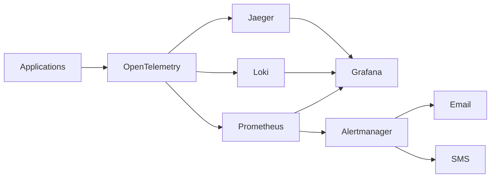
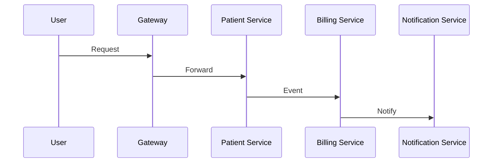

# Observability Architecture

## Document Information

| Field | Value |
|--------|--------|
| Project | Enterprise Hospital Management System (EHMS) |
| Phase | Phase 1.5 – Enterprise Solution Design |
| Document | Observability Architecture |
| Version | 1.0 |
| Status | Approved |
| Author | Pavithra K V |

---

# Executive Summary

The Observability Architecture defines how the Enterprise Hospital Management System (EHMS) monitors, measures, traces, and logs the health of every application, service, database, and infrastructure component.

The architecture enables proactive monitoring, rapid troubleshooting, capacity planning, and operational excellence.

---

# 1. Purpose

The objectives are:

- Monitor application health.
- Detect failures early.
- Improve troubleshooting.
- Measure performance.
- Support root cause analysis.
- Improve system reliability.

---

# 2. Observability Pillars

EHMS follows three pillars of observability:

- Metrics
- Logs
- Traces

Together they provide complete operational visibility.

---

# 3. Technology Stack

| Component | Technology |
|------------|------------|
| Metrics | Prometheus |
| Dashboards | Grafana |
| Logs | Loki + ELK Stack |
| Distributed Tracing | OpenTelemetry |
| Alerting | Prometheus Alertmanager |

---

# 4. High-Level Architecture



---

# 5. Metrics Collection

Every service exposes metrics.

Examples:

- HTTP Requests
- Response Time
- CPU Usage
- Memory Usage
- Active Connections
- Queue Length
- Database Queries

---

# 6. Logging Architecture

```mermaid
flowchart LR

Application

↓

Structured Logs

↓

Loki

↓

Grafana
```

---

# 7. Structured Logging

Every log contains:

- Timestamp
- Service Name
- Log Level
- Correlation ID
- User ID (if applicable)
- Request ID
- Message

Example:

```json
{
  "timestamp":"2026-01-01T10:20:00Z",
  "service":"patient-service",
  "level":"INFO",
  "traceId":"UUID",
  "message":"Patient created successfully"
}
```

---

# 8. Distributed Tracing

Tracing follows requests across services.



Every request includes:

- Trace ID
- Span ID
- Parent Span

---

# 9. Health Checks

Each service exposes:

```
/health

/ready

/live
```

Health checks monitor:

- Database
- RabbitMQ
- Redis
- External APIs

---

# 10. Dashboards

Grafana dashboards include:

- API Performance
- Database Metrics
- RabbitMQ Metrics
- Redis Metrics
- Service Availability
- Infrastructure Status

---

# 11. Alerting

Critical alerts:

- Service Down
- Database Offline
- High CPU Usage
- High Memory Usage
- Queue Backlog
- Authentication Failures
- Disk Space Low

---

# 12. Service Level Objectives (SLOs)

| Metric | Target |
|---------|--------|
| API Availability | 99.9% |
| Authentication | <300 ms |
| Patient Search | <500 ms |
| Appointment Booking | <800 ms |
| Critical Alerts | <5 min response |

---

# 13. Log Retention

| Log Type | Retention |
|----------|-----------|
| Application | 30 Days |
| Audit | 1 Year |
| Security | 1 Year |
| Error | 90 Days |

Retention periods should comply with organizational policies and applicable regulations.

---

# 14. Security

Observability systems must:

- Protect logs.
- Restrict dashboard access.
- Mask sensitive data.
- Encrypt data in transit.
- Audit administrative actions.

---

# 15. Monitoring Scope

Monitor:

- Microservices
- Databases
- Redis
- RabbitMQ
- API Gateway
- Docker Containers
- Kubernetes Cluster
- Host Infrastructure

---

# 16. Capacity Planning

Track:

- CPU Trends
- Memory Growth
- Storage Usage
- Network Traffic
- Queue Growth
- Database Size

---

# 17. Architecture Decisions

| Decision | Reason |
|----------|--------|
| Prometheus | Metrics |
| Grafana | Dashboards |
| OpenTelemetry | Tracing |
| Loki | Log aggregation |
| Alertmanager | Alerts |

---

# 18. Risks & Mitigation

| Risk | Mitigation |
|------|------------|
| Missing metrics | Standard instrumentation |
| Large log volume | Retention policies |
| Alert fatigue | Alert tuning |
| Sensitive data exposure | Log masking |

---

# 19. Future Enhancements

Future improvements include:

- AI-assisted anomaly detection
- Predictive capacity planning
- Automated root cause analysis
- Business KPI dashboards
- SRE scorecards

---

# 20. Related Documents

- 19 Security Architecture
- 22 Coding Standards
- 24 Deployment Architecture
- 26 Performance & Scalability Strategy

---

# 21. Conclusion

The Observability Architecture provides comprehensive visibility into EHMS through metrics, logs, traces, dashboards, and alerts. It enables proactive operations, faster incident response, and continuous performance improvement while supporting reliable healthcare services.