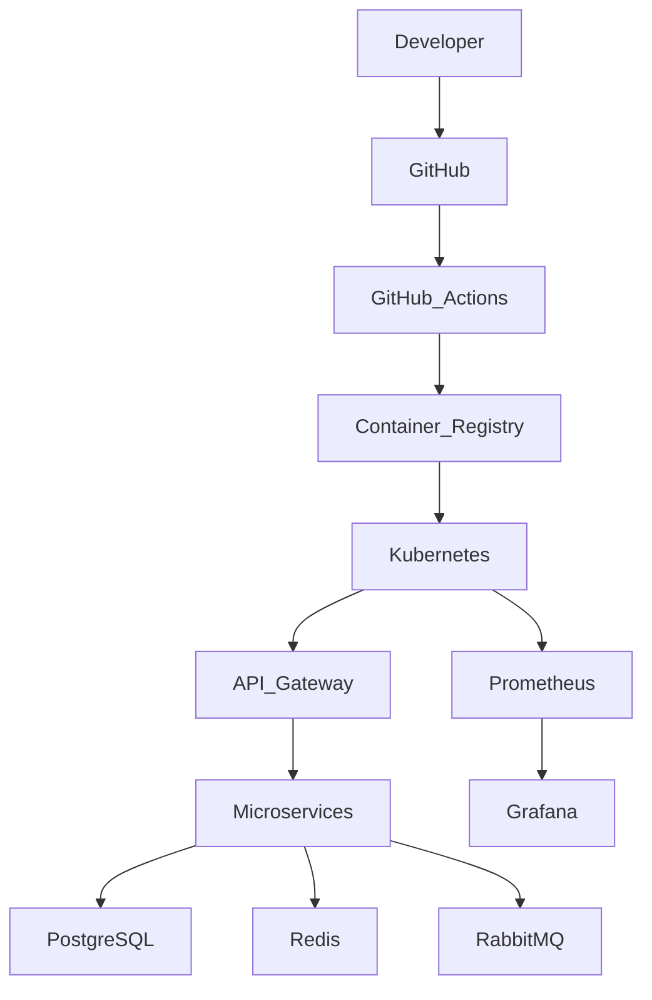

# Deployment Architecture

## Document Information

| Field | Value |
|--------|--------|
| Project | Enterprise Hospital Management System (EHMS) |
| Phase | Phase 1.5 – Enterprise Solution Design |
| Document | Deployment Architecture |
| Version | 1.0 |
| Status | Approved |
| Author | Pavithra K V |

---

# Executive Summary

The Deployment Architecture defines how the Enterprise Hospital Management System (EHMS) is packaged, deployed, monitored, and operated across development, testing, staging, and production environments.

The architecture emphasizes automation, reliability, scalability, repeatability, and minimal downtime using containerization and CI/CD.

---

# 1. Purpose

This document aims to:

- Standardize deployments.
- Enable repeatable releases.
- Support multiple environments.
- Reduce deployment risks.
- Improve scalability.
- Support disaster recovery.

---

# 2. Deployment Principles

EHMS follows:

- Containerization
- Infrastructure as Code
- Immutable Deployments
- Zero-Downtime Deployment
- Automated CI/CD
- Environment Isolation

---

# 3. Technology Stack

| Layer | Technology |
|--------|------------|
| Containers | Docker |
| Local Orchestration | Docker Compose |
| Production Orchestration | Kubernetes |
| CI/CD | GitHub Actions |
| Image Registry | GitHub Container Registry |
| Reverse Proxy | NGINX |
| Monitoring | Prometheus + Grafana |
| Logging | Loki |

---

# 4. Deployment Environments

| Environment | Purpose |
|------------|----------|
| Development | Local development |
| Testing | Automated testing |
| Staging | Production validation |
| Production | Live hospital system |

Each environment has isolated configuration and infrastructure.

---

# 5. High-Level Deployment Architecture



---

# 6. Local Development

Local development uses Docker Compose.

Components:

- PostgreSQL
- Redis
- RabbitMQ
- MinIO
- API Gateway
- Required microservices

Benefits:

- Fast setup
- Consistent environment
- Easy onboarding

---

# 7. CI/CD Pipeline

```mermaid
flowchart LR

Code

↓

Git Push

↓

GitHub Actions

↓

Lint

↓

Tests

↓

Build Docker Images

↓

Security Scan

↓

Push Images

↓

Deploy
```

---

# 8. Build Pipeline

Pipeline stages:

1. Checkout Code
2. Install Dependencies
3. Lint
4. Run Tests
5. Build Docker Images
6. Security Scan
7. Push Images
8. Deploy

---

# 9. Deployment Strategy

Production deployment uses:

- Rolling Updates
- Health Checks
- Readiness Probes
- Automatic Rollback

Zero-downtime deployment is the target.

---

# 10. Container Standards

Each service contains:

- Dockerfile
- Health Check
- Non-root user
- Environment Variables
- Structured Logging

---

# 11. Infrastructure Components

Production infrastructure includes:

- API Gateway
- Microservices
- PostgreSQL
- Redis
- RabbitMQ
- Prometheus
- Grafana
- Loki
- Alertmanager

---

# 12. Kubernetes Resources

Each service includes:

- Deployment
- Service
- ConfigMap
- Secret
- HorizontalPodAutoscaler
- Ingress

---

# 13. Health Checks

Every service exposes:

```
/health

/live

/ready
```

Deployment proceeds only if readiness checks pass.

---

# 14. Scaling Strategy

Horizontal scaling based on:

- CPU usage
- Memory usage
- Request rate
- Queue length

Stateless services should scale independently.

---

# 15. Rollback Strategy

Rollback occurs when:

- Health checks fail
- Deployment errors occur
- Performance degrades significantly

Rollback restores the previous stable release.

---

# 16. Security

Deployment security includes:

- Signed container images
- Secret management
- Network policies
- TLS
- Image vulnerability scanning
- Least privilege service accounts

---

# 17. Release Management

Release process:

- Semantic versioning
- Release notes
- Tagged releases
- Deployment approval for production
- Post-deployment validation

---

# 18. Architecture Decisions

| Decision | Reason |
|----------|--------|
| Docker | Consistent packaging |
| Kubernetes | Scalability |
| GitHub Actions | CI/CD automation |
| Rolling Updates | Zero downtime |
| Health Checks | Reliability |

---

# 19. Risks & Mitigation

| Risk | Mitigation |
|------|------------|
| Failed deployment | Automatic rollback |
| Configuration mismatch | Environment isolation |
| Container vulnerability | Security scanning |
| Downtime | Rolling updates |

---

# 20. Future Enhancements

Future improvements include:

- Blue-Green Deployment
- Canary Releases
- GitOps (Argo CD)
- Multi-region Kubernetes
- Service Mesh (Istio)

---

# 21. Related Documents

- 16 Configuration Management
- 22 Coding Standards
- 23 Observability Architecture
- 25 Disaster Recovery

---

# 22. Conclusion

The Deployment Architecture provides a repeatable, secure, and scalable deployment strategy for EHMS. Through containerization, Kubernetes orchestration, CI/CD automation, and health-aware deployments, the platform supports reliable delivery and operational excellence across all environments.