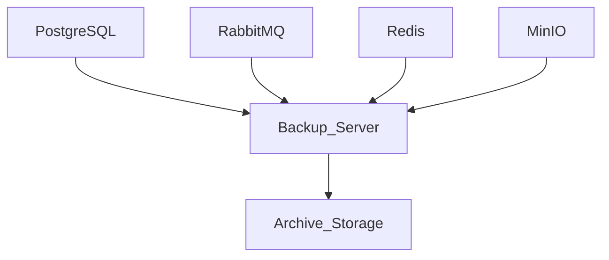

# Disaster Recovery Architecture

## Document Information

| Field | Value |
|--------|--------|
| Project | Enterprise Hospital Management System (EHMS) |
| Phase | Phase 1.5 – Enterprise Solution Design |
| Document | Disaster Recovery Architecture |
| Version | 1.0 |
| Status | Approved |
| Author | Pavithra K V |

---

# Executive Summary

The Disaster Recovery (DR) Architecture defines how the Enterprise Hospital Management System (EHMS) maintains business continuity during hardware failures, software failures, cyber incidents, infrastructure outages, or human errors.

The architecture establishes backup strategies, recovery objectives, failover procedures, disaster response processes, and regular recovery testing.

---

# 1. Purpose

This document aims to:

- Ensure business continuity.
- Minimize downtime.
- Prevent permanent data loss.
- Define recovery procedures.
- Support operational resilience.
- Enable rapid service restoration.

---

# 2. Disaster Recovery Principles

EHMS follows:

- Business Continuity
- Defense in Depth
- Redundancy
- Automated Backups
- Regular Recovery Testing
- Documented Recovery Procedures
- Continuous Monitoring

---

# 3. Disaster Scenarios

EHMS prepares for:

- Server failure
- Database corruption
- Storage failure
- Network outage
- Application failure
- Ransomware attack
- Accidental data deletion
- Cloud/Infrastructure outage

---

# 4. Recovery Objectives

| Objective | Target |
|-----------|--------|
| RTO (Recovery Time Objective) | ≤ 2 Hours |
| RPO (Recovery Point Objective) | ≤ 15 Minutes |
| Critical Service Availability | 99.9% |

> These targets can be adjusted based on the deployment environment and operational requirements.

---

# 5. Backup Strategy

## Database

- Daily full backup
- Hourly incremental backup
- Transaction log backup where applicable

## File Storage

- Daily snapshot
- Weekly archive

## Configuration

- Version controlled
- Secure backup

---

# 6. Backup Architecture



---

# 7. Backup Retention

| Backup | Retention |
|----------|-----------|
| Hourly | 24 Hours |
| Daily | 30 Days |
| Weekly | 12 Weeks |
| Monthly | 12 Months |

Retention policies should align with organizational requirements and applicable regulations.

---

# 8. Recovery Process

```mermaid
flowchart LR

Incident

↓

Detection

↓

Assessment

↓

Recovery Plan

↓

Restore Systems

↓

Validation

↓

Return to Service
```

---

# 9. Database Recovery

Recovery steps:

1. Stop affected services.
2. Restore latest backup.
3. Apply incremental backups if available.
4. Validate database integrity.
5. Restart services.
6. Verify application functionality.

---

# 10. Infrastructure Recovery

Recover:

- Docker containers
- Kubernetes workloads
- Redis
- RabbitMQ
- API Gateway
- Monitoring systems

Infrastructure should be reproducible using Infrastructure as Code where possible.

---

# 11. Failover Strategy

Production supports:

- Health checks
- Automatic restart
- Load balancing
- Database replication (future)
- Multi-node deployment (future)

---

# 12. Recovery Validation

After restoration verify:

- User authentication
- Patient registration
- Appointment booking
- Billing
- Laboratory workflow
- Pharmacy workflow
- Reports

---

# 13. Disaster Recovery Testing

Testing schedule:

| Test | Frequency |
|------|-----------|
| Backup Verification | Weekly |
| Database Restore Test | Monthly |
| Full Disaster Recovery Drill | Quarterly |

Every test should be documented and reviewed.

---

# 14. Security During Recovery

Recovery operations must:

- Protect backup data.
- Verify backup integrity.
- Restrict recovery access.
- Maintain audit logs.
- Rotate credentials if compromise is suspected.

---

# 15. Monitoring

Monitor:

- Backup success
- Backup failures
- Storage utilization
- Recovery duration
- Replication status
- Backup integrity

---

# 16. Roles & Responsibilities

| Role | Responsibility |
|------|----------------|
| System Administrator | Infrastructure recovery |
| Database Administrator | Database restoration |
| DevOps Engineer | Deployment recovery |
| Security Team | Incident investigation |
| Application Team | Functional validation |

---

# 17. Architecture Decisions

| Decision | Reason |
|----------|--------|
| Automated backups | Reduce manual errors |
| Incremental backups | Faster recovery |
| Recovery testing | Validate preparedness |
| Version-controlled configuration | Faster restoration |
| Infrastructure as Code | Repeatable recovery |

---

# 18. Risks & Mitigation

| Risk | Mitigation |
|------|------------|
| Backup failure | Automated monitoring |
| Corrupted backups | Integrity verification |
| Long recovery time | Regular recovery drills |
| Human error | Documented procedures |

---

# 19. Future Enhancements

Future improvements include:

- Cross-region disaster recovery
- Active-active deployment
- Automated failover
- Immutable backup storage
- Continuous backup replication

---

# 20. Related Documents

- 16 Configuration Management
- 19 Security Architecture
- 23 Observability Architecture
- 24 Deployment Architecture
- 26 Performance & Scalability Strategy

---

# 21. Conclusion

The Disaster Recovery Architecture provides a structured approach to protecting EHMS against operational disruptions. Through reliable backups, defined recovery objectives, regular testing, and documented procedures, the platform is designed to recover efficiently while maintaining the integrity of hospital operations.