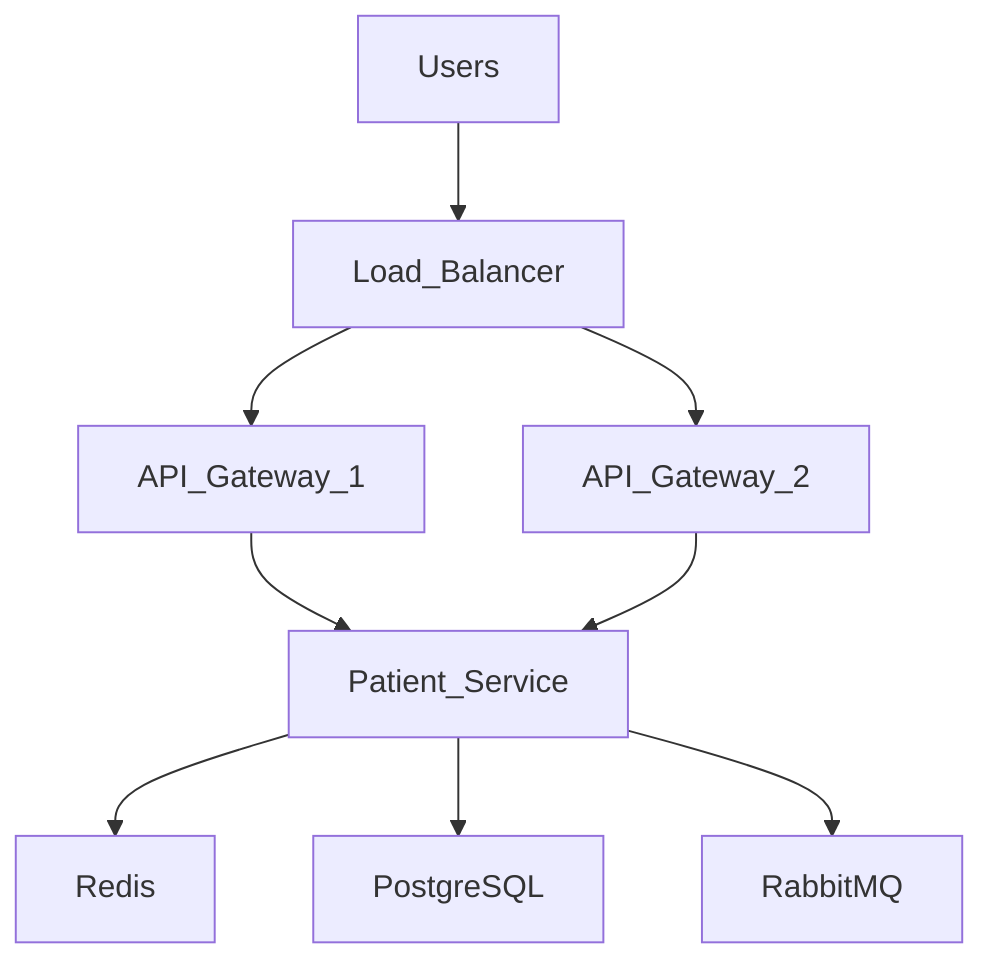

# Performance & Scalability Strategy

## Document Information

| Field | Value |
|--------|--------|
| Project | Enterprise Hospital Management System (EHMS) |
| Phase | Phase 1.5 – Enterprise Solution Design |
| Document | Performance & Scalability Strategy |
| Version | 1.0 |
| Status | Approved |
| Author | Pavithra K V |

---

# Executive Summary

The Performance & Scalability Strategy defines how the Enterprise Hospital Management System (EHMS) achieves responsive performance, efficient resource utilization, and horizontal scalability as hospital operations and user traffic increase.

The architecture combines optimized application design, caching, asynchronous processing, database tuning, load balancing, and autoscaling to deliver reliable performance while supporting future expansion.

---

# 1. Purpose

This document aims to:

- Define performance objectives.
- Support increasing workloads.
- Improve response times.
- Optimize infrastructure utilization.
- Enable horizontal scaling.
- Support future hospital expansion.

---

# 2. Performance Principles

EHMS follows:

- Performance by Design
- Horizontal Scalability
- Stateless Services
- Efficient Resource Usage
- Asynchronous Processing
- Intelligent Caching
- Continuous Performance Monitoring

---

# 3. Performance Targets

| Component | Target |
|-----------|--------|
| Login | <300 ms |
| Patient Search | <500 ms |
| Appointment Booking | <800 ms |
| Dashboard | <1 second |
| Report Generation | <5 seconds |
| API Availability | 99.9% |

---

# 4. High-Level Scalability Architecture

---

# 5. Horizontal Scaling

The following components should support horizontal scaling:

- API Gateway
- Patient Service
- Appointment Service
- Billing Service
- Notification Service
- Analytics Service

Scaling should occur independently where possible.

---

# 6. Vertical Scaling

Vertical scaling may be applied to:

- PostgreSQL
- Redis
- RabbitMQ

Resource allocation should be monitored and adjusted based on workload.

---

# 7. Load Balancing

Production traffic is distributed using:

- NGINX
- Kubernetes Services
- Ingress Controller

Strategies:

- Round Robin
- Least Connections
- Health-based routing

---

# 8. Caching Strategy

Redis is used for:

- Session data
- Frequently accessed reference data
- Doctor availability
- Department information
- Configuration cache
- API response caching (where appropriate)

Cache invalidation is driven by data updates or expiration policies.

---

# 9. Database Optimization

Optimization techniques:

- Proper indexing
- Query optimization
- Connection pooling
- Partitioning (large tables)
- Read replicas (future)

Avoid:

- N+1 queries
- Full table scans
- Long-running transactions

---

# 10. RabbitMQ Optimization

Optimize through:

- Multiple consumers
- Queue monitoring
- Message batching where appropriate
- Dead Letter Queues
- Retry queues

---

# 11. Connection Pooling

Each service should use connection pooling.

Monitor:

- Active connections
- Idle connections
- Wait time
- Pool utilization

---

# 12. Asynchronous Processing

Background tasks include:

- Notifications
- Report generation
- Analytics
- Audit logging
- File processing
- Email delivery

RabbitMQ is the preferred mechanism for asynchronous processing.

---

# 13. Static Content

Static assets should be:

- Compressed
- Browser cached
- Versioned

A CDN may be introduced if public-facing assets grow significantly.

---

# 14. Performance Monitoring

Monitor:

- Response time
- Throughput
- Error rate
- CPU usage
- Memory usage
- Database latency
- Queue depth

---

# 15. Capacity Planning

Review periodically:

- User growth
- Database size
- Storage usage
- API traffic
- Queue volume
- Peak usage periods

Capacity planning should be based on measured usage trends.

---

# 16. Performance Testing

Testing includes:

- Load Testing
- Stress Testing
- Spike Testing
- Endurance Testing
- Scalability Testing

Performance tests should be integrated into release validation where practical.

---

# 17. Autoscaling

Autoscaling decisions may use:

- CPU utilization
- Memory utilization
- Request rate
- Queue length

Minimum and maximum replica counts should be defined for production.

---

# 18. Service Level Objectives (SLOs)

| Metric | Target |
|---------|--------|
| Availability | 99.9% |
| Error Rate | <1% |
| API Latency | <500 ms (typical APIs) |
| Queue Processing Delay | <30 seconds |

---

# 19. Architecture Decisions

| Decision | Reason |
|----------|--------|
| Redis | High-speed caching |
| RabbitMQ | Asynchronous workloads |
| Kubernetes | Horizontal scaling |
| Stateless Services | Elastic scaling |
| Load Balancer | Traffic distribution |

---

# 20. Risks & Mitigation

| Risk | Mitigation |
|------|------------|
| High traffic | Horizontal scaling |
| Slow database | Indexing & optimization |
| Queue backlog | Additional consumers |
| Cache inconsistency | Cache invalidation strategy |

---

# 21. Future Enhancements

Future improvements include:

- Multi-region deployment
- Global load balancing
- Edge caching
- AI-assisted autoscaling
- Read/write database separation
- Predictive capacity planning

---

# 22. Related Documents

- 12 Message Broker Design
- 21 Database Design Standards
- 23 Observability Architecture
- 24 Deployment Architecture
- 25 Disaster Recovery

---

# 23. Conclusion

The Performance & Scalability Strategy provides a roadmap for ensuring that EHMS remains responsive, reliable, and scalable as user demand and hospital operations grow. By combining caching, efficient database design, asynchronous processing, load balancing, and autoscaling, the platform is prepared to support both current requirements and future expansion.