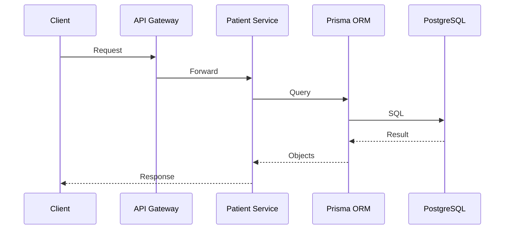

# PostgreSQL Architecture

## Document Information

| Field | Value |
|--------|--------|
| Project | Enterprise Hospital Management System (EHMS) |
| Phase | Phase 2 – Database Engineering |
| Document | PostgreSQL Architecture |
| Version | 1.0 |
| Status | Approved |
| Author | Pavithra K V |

---

# Executive Summary

The Enterprise Hospital Management System (EHMS) uses PostgreSQL as its primary relational database management system.

PostgreSQL provides ACID-compliant transactions, strong data integrity, advanced indexing, JSON support, full-text search, extensibility, and excellent compatibility with Prisma ORM.

Each EHMS microservice owns its own PostgreSQL schema, ensuring clear data ownership, loose coupling, and independent evolution.

---

# 1. Purpose

This document defines:

- PostgreSQL architecture
- Database organization
- Schema ownership
- Connection strategy
- Storage architecture
- High availability strategy
- Performance considerations

---

# 2. Why PostgreSQL?

PostgreSQL was selected because it provides:

- ACID compliance
- High reliability
- Excellent performance
- JSONB support
- Full-text search
- Strong indexing
- Extensions
- Mature ecosystem
- Prisma compatibility

---

# 3. Database Architecture

```mermaid
graph TD

Application

↓

API Gateway

↓

Microservices

↓

PostgreSQL

↓

Schemas

↓

Tables

↓

Indexes
```

---

# 4. Database-per-Service Strategy

Each microservice owns its own schema.

Example:

| Service | Schema |
|---------|--------|
| auth-service | auth_db |
| user-service | user_db |
| patient-service | patient_db |
| doctor-service | doctor_db |
| appointment-service | appointment_db |
| opd-service | opd_db |
| ipd-service | ipd_db |
| ehr-service | ehr_db |
| laboratory-service | laboratory_db |
| radiology-service | radiology_db |
| pharmacy-service | pharmacy_db |
| billing-service | billing_db |
| analytics-service | analytics_db |

No service directly reads or writes another service's schema.

---

# 5. Logical Architecture


---

# 6. Connection Flow



---

# 7. Database Components

Each schema contains:

- Tables
- Views (where required)
- Indexes
- Constraints
- Functions (only when necessary)
- Migration history

---

# 8. Transaction Model

Transactions follow ACID principles.

Properties:

- Atomicity
- Consistency
- Isolation
- Durability

Cross-service transactions are avoided.

Event-driven workflows are used instead.

---

# 9. Storage Strategy

Store:

- Structured relational data
- JSONB where flexibility is beneficial
- Audit metadata
- Configuration data
- Business records

Large binary objects (medical images, scanned documents, etc.) should be stored in object storage (e.g., MinIO or cloud object storage), with only metadata and references stored in PostgreSQL.

---

# 10. Connection Pooling

Each service uses connection pooling.

Monitor:

- Active connections
- Idle connections
- Pool size
- Wait time

Connection pool settings should be tuned based on workload and deployment environment.

---

# 11. Backup Strategy

Database backups include:

- Full backups
- Incremental backups
- Point-in-time recovery (PITR), if enabled

Backups must be encrypted and tested regularly.

---

# 12. Security

Database security includes:

- TLS connections
- Role-based access
- Least privilege
- Encrypted backups
- Audit logging

---

# 13. Monitoring

Monitor:

- Query performance
- Connection count
- Index usage
- Storage growth
- Replication status (future)
- Slow queries

---

# 14. High Availability

Future production architecture supports:

- Primary database
- Standby replica
- Automatic failover
- Read replicas
- Backup server

---

# 15. PostgreSQL Extensions

Recommended extensions:

| Extension | Purpose |
|-----------|---------|
| pgcrypto | Cryptographic functions |
| uuid-ossp *(or native UUID generation depending on PostgreSQL version)* | UUID generation |
| pg_trgm | Similarity search |
| btree_gin | Advanced indexing |

Enable extensions only when required by the service.

---

# 16. Prisma Integration

Prisma responsibilities:

- Schema definition
- Migrations
- Type-safe database access
- Query generation
- Seed execution

PostgreSQL remains the authoritative data store.

---

# 17. Architecture Decisions

| Decision | Reason |
|----------|--------|
| PostgreSQL | Enterprise-grade RDBMS |
| Prisma ORM | Type-safe data access |
| Database per Service | Service autonomy |
| UUID primary keys | Global uniqueness |
| JSONB support | Flexible attributes |

---

# 18. Risks & Mitigation

| Risk | Mitigation |
|------|------------|
| Slow queries | Index optimization |
| Connection exhaustion | Connection pooling |
| Large tables | Partitioning |
| Data loss | Automated backups |

---

# 19. Future Enhancements

Future improvements include:

- PostgreSQL replication
- Read replicas
- Sharding (if required)
- Multi-region deployment
- Logical replication

---

# 20. Related Documents

- 00 Database Overview
- 02 Database Naming Standards
- 07 Indexing Strategy
- 09 Migration Strategy

---

# 21. Conclusion

The PostgreSQL Architecture establishes the enterprise database foundation for EHMS. Through clear schema ownership, robust transaction handling, strong security, and scalable design, PostgreSQL provides a reliable platform for implementing the hospital management system.