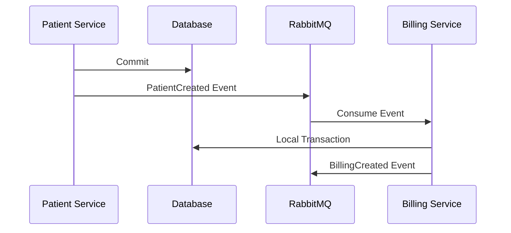

# Transaction Strategy

## Document Information

| Field | Value |
|--------|--------|
| Project | Enterprise Hospital Management System (EHMS) |
| Phase | Phase 2 – Database Engineering |
| Document | Transaction Strategy |
| Version | 1.0 |
| Status | Approved |
| Author | Pavithra K V |

---

# Executive Summary

The Transaction Strategy defines how EHMS maintains data consistency and integrity during database operations.

Each microservice manages transactions within its own database using PostgreSQL ACID transactions. Cross-service consistency is achieved through asynchronous event-driven communication rather than distributed database transactions.

---

# 1. Purpose

This document defines:

- Transaction boundaries
- ACID compliance
- Local transactions
- Cross-service consistency
- Error handling
- Retry strategies

---

# 2. Transaction Principles

EHMS follows:

- ACID Transactions
- Database per Service
- Local Transactions Only
- Eventual Consistency
- Short-lived Transactions
- Automatic Rollback

---

# 3. ACID Properties

| Property | Description |
|----------|-------------|
| Atomicity | All operations succeed or none |
| Consistency | Database remains valid |
| Isolation | Concurrent transactions do not interfere |
| Durability | Committed changes survive failures |

---

# 4. Local Transaction Flow

```mermaid
flowchart LR

Start

↓

Validate Request

↓

Begin Transaction

↓

Execute Operations

↓

Commit

↓

Publish Event

↓

End
```

If an error occurs before commit:

```text
Rollback Transaction

↓

Return Error
```

---

# 5. Cross-Service Transactions

Distributed database transactions are **not used**.

Instead:



Each service owns its own transaction.

---

# 6. Transaction Scope

Transactions should include only:

- Related database operations
- Validation
- Business rule enforcement

Avoid:

- External API calls
- Long-running operations
- File uploads
- Email sending

These should occur after the transaction commits.

---

# 7. Error Handling

On failure:

- Roll back transaction
- Log the error
- Return appropriate response
- Do not leave partial updates

---

# 8. Retry Strategy

Retry only for transient failures such as:

- Temporary network issues
- Deadlocks
- Connection interruptions

Do not retry:

- Validation failures
- Constraint violations
- Authorization failures

---

# 9. Isolation Level

Default PostgreSQL isolation:

```
READ COMMITTED
```

Use stricter isolation levels only when required by business logic.

---

# 10. Concurrency Control

Techniques include:

- Optimistic locking
- Unique constraints
- Row-level locking (when necessary)
- Version columns

Choose the least restrictive approach that satisfies business requirements.

---

# 11. Long Running Operations

Examples:

- Report generation
- Notification sending
- PDF generation
- AI processing
- File uploads

These execute asynchronously through RabbitMQ after transaction completion.

---

# 12. Prisma Example

```typescript
await prisma.$transaction(async (tx) => {

  await tx.patient.create(...)

  await tx.patientAddress.create(...)

})
```

All operations either succeed together or fail together.

---

# 13. Monitoring

Monitor:

- Transaction duration
- Rollback count
- Deadlocks
- Lock waits
- Failed commits

---

# 14. Architecture Decisions

| Decision | Reason |
|----------|--------|
| Local transactions | Service independence |
| Eventual consistency | Microservice scalability |
| Short transactions | Better performance |
| Automatic rollback | Data integrity |
| RabbitMQ events | Cross-service coordination |

---

# 15. Risks & Mitigation

| Risk | Mitigation |
|------|------------|
| Deadlocks | Consistent operation order |
| Long transactions | Keep transactions small |
| Partial updates | Automatic rollback |
| Event delivery failure | Retry & Dead Letter Queues |

---

# 16. Future Enhancements

Future improvements include:

- Saga orchestration
- Saga choreography
- Transaction monitoring dashboards
- Automatic compensation workflows
- Event replay capabilities

---

# 17. Related Documents

- 10 Event Driven Architecture (Phase 1.5)
- 12 Message Broker Design (Phase 1.5)
- 06 Indexing Strategy
- 08 Migration Strategy

---

# 18. Conclusion

The Transaction Strategy ensures that EHMS maintains strong consistency within each microservice while supporting scalable, event-driven communication across services. This approach preserves data integrity without introducing the complexity of distributed database transactions.