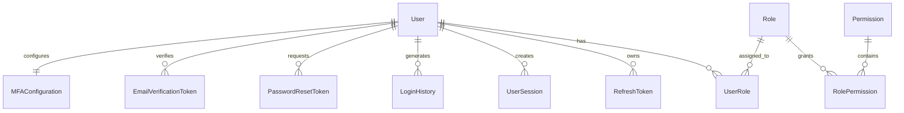

# Auth Service Entity Relationship Diagram (ERD)

## Document Information

| Field | Value |
|--------|--------|
| Project | Enterprise Hospital Management System (EHMS) |
| Phase | Phase 2.2 – Service Database Engineering |
| Service | Auth Service |
| Document | Entity Relationship Diagram |
| Version | 1.0 |
| Status | Approved |
| Author | Pavithra K V |

---

# Executive Summary

This document defines the Entity Relationship Diagram (ERD) for the Auth Service database.

The ERD describes the entities, primary keys, foreign keys, cardinality, and relationships required to implement authentication, authorization, session management, and security within EHMS.

This ERD serves as the blueprint for the Prisma schema.

---

# 1. Database Entities

The Auth Service database contains the following entities:

| Entity | Purpose |
|---------|----------|
| User | Authentication identity |
| Role | Security role |
| Permission | Individual permission |
| UserRole | User-role mapping |
| RolePermission | Role-permission mapping |
| RefreshToken | Refresh tokens |
| UserSession | Active sessions |
| LoginHistory | Login audit |
| PasswordResetToken | Password reset |
| EmailVerificationToken | Email verification |
| MFAConfiguration | Multi-factor authentication |

---

# 2. High-Level ER Diagram



---

# 3. Detailed Entity Relationships

## User ↔ UserRole

Relationship

```
One User

↓

Many User Roles
```

Purpose

Assign multiple roles to one user.

---

## Role ↔ UserRole

Relationship

```
One Role

↓

Many User Assignments
```

Purpose

Allow many users to share one role.

---

## Role ↔ RolePermission

Relationship

```
One Role

↓

Many Permissions
```

Purpose

RBAC implementation.

---

## Permission ↔ RolePermission

Relationship

```
One Permission

↓

Many Roles
```

Purpose

Reusable permissions.

---

## User ↔ RefreshToken

Relationship

```
One User

↓

Many Refresh Tokens
```

Purpose

Multiple logged-in devices.

---

## User ↔ UserSession

Relationship

```
One User

↓

Many Sessions
```

Purpose

Track active devices.

---

## User ↔ LoginHistory

Relationship

```
One User

↓

Many Login Attempts
```

Purpose

Security audit.

---

## User ↔ PasswordResetToken

Relationship

```
One User

↓

Many Password Reset Requests
```

Purpose

Password recovery.

---

## User ↔ EmailVerificationToken

Relationship

```
One User

↓

Many Verification Requests
```

Purpose

Email confirmation.

---

## User ↔ MFAConfiguration

Relationship

```
One User

↓

One MFA Configuration
```

Purpose

Optional MFA settings.

---

# 4. Cardinality Matrix

| Parent | Child | Relationship |
|----------|--------|--------------|
| User | UserRole | 1:N |
| Role | UserRole | 1:N |
| Role | RolePermission | 1:N |
| Permission | RolePermission | 1:N |
| User | RefreshToken | 1:N |
| User | UserSession | 1:N |
| User | LoginHistory | 1:N |
| User | PasswordResetToken | 1:N |
| User | EmailVerificationToken | 1:N |
| User | MFAConfiguration | 1:1 |

---

# 5. Primary Keys

Every entity uses

```
UUID
```

Example

```
id UUID PRIMARY KEY
```

---

# 6. Foreign Keys

| Table | Foreign Key |
|---------|-------------|
| user_roles | user_id |
| user_roles | role_id |
| role_permissions | role_id |
| role_permissions | permission_id |
| refresh_tokens | user_id |
| user_sessions | user_id |
| login_history | user_id |
| password_reset_tokens | user_id |
| email_verification_tokens | user_id |
| mfa_configurations | user_id |

---

# 7. Relationship Rules

- One user may have multiple roles.
- One role may belong to multiple users.
- One role may contain many permissions.
- One permission may belong to multiple roles.
- One user may have multiple sessions.
- One user may have multiple refresh tokens.
- A user has at most one MFA configuration.

---

# 8. Referential Integrity

All foreign keys enforce referential integrity.

Deletion behavior:

- User → Sessions: CASCADE
- User → Refresh Tokens: CASCADE
- User → Login History: RESTRICT
- User → Password Reset Tokens: CASCADE
- User → Email Verification Tokens: CASCADE
- User → MFA Configuration: CASCADE

Historical login records are preserved for auditing.

---

# 9. Database Normalization

The schema follows:

- First Normal Form (1NF)
- Second Normal Form (2NF)
- Third Normal Form (3NF)

Many-to-many relationships are resolved using junction tables.

---

# 10. Architecture Decisions

| Decision | Reason |
|----------|--------|
| Junction tables | Flexible RBAC |
| UUID keys | Distributed architecture |
| One MFA per user | Simpler management |
| Separate token tables | Security isolation |
| Login history retained | Auditing |

---

# 11. Related Documents

- 02 Domain Model
- 04 Entity Definitions
- 05 Prisma Schema
- UUID Strategy
- Database Naming Standards

---

# 12. Conclusion

The Auth Service ER Diagram defines the structural relationships between authentication entities within EHMS. It establishes a normalized, scalable, and secure relational model that will be implemented using PostgreSQL and Prisma ORM.